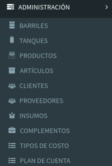

# Menú Web

El módulo **Administración** se compone de las siguientes pantallas:

* **Administración  de Barriles**: 



* **Administración de Tanques**: 



* **Administración de Productos**: 



* **Administración de Artículos**: 



* **Administración de Clientes**: 



* **Administración de Proveedores:** 



* **Administración de Insumos:**



* **Administración de Complementos:**



* **Administración de Tipos de Costo:**



* **Administración de Plan de Cuenta:**



