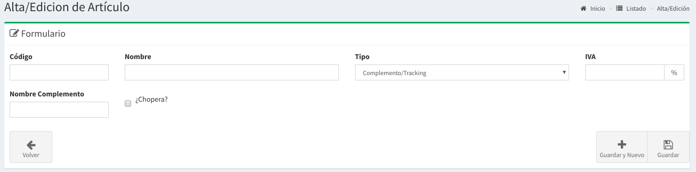

# Articulos

## Listado de Artículos

En esta pantalla se podrá observar todos los artículos disponibles  Las columnas darán un detalle de los datos relevantes de los artículos desde el punto de vista de la administración.

* **Código**: un nombre alfanumérico para identificar al mismo.
* **Nombre:** Es el nombre comercial con el que se vende el artículo.
* **Complemento:** Describe si se trata de un complemento o no.
* **IVA:**  Es la alícuota de IVA que aplica al producto.
* **Stock:** Muestra la cantidad de Stock de ese Artículo
* **Stock Mínimo:** Muestra cual es el stock mínimo para ese artículos
* **Activo:** Muestra si se encuentra `ACTIVO` o `INACTIVO`

## Búsqueda de Artículos

Por medio de la barra de búsqueda se podrá filtrar los **artículos** por su **nombre.** Basta escribir un texto y apretar `Enter`

## Tipos de Artículos

El sistema provee de  4 tipos de artículos posibles:

* **Servicios:**
  * Se utilizan para cobrar en las ventas por un servicios como por ejemplo un `Flete`. Es algo que queremos cobrarle al cliente por un servicio.
* **Complemento / Tracking:**
  * Se utiliza para cobrar por un bien al que ademas queremos realizarle un seguimiento. Ejemplo: una canilla, una chopera. No solo podemos querer cobrar por el servicio sino que además queremos saber quien tiene nuestros bienes que damos en como prestamos.
* **Artículos con Stock:**
  * Se usa para cobrar por un artículo que no fabricamos pero si poseemos Stock, como por ejemplo Vasos, Llaveros, Remeras, etc
* **Artículos sin Stock:**
  * Se usa para cobrar por un artículo que no fabricamos pero no queremos llevar el Stock por sistema \(Podrían ser los mismos que en el punto anterior\)

## Nuevo Artículo

Basta hacer `click` a la derecha de la barra de búsqueda en el botón **'Nuevo'** para acceder al formulario para la creación de un nuevo artículo.

Luego de esto aparecerá un formulario como el que sigue:

Los datos solicitados varias según el tipo de artículo

* **Código:**  es un código corto \(alfanumérico\) del artículo
* **Nombre:**  es el nombre con el que se vende el artículo.
* **Tipo:** Es uno de los tipos explicados anteriormente.
* **IVA:** Es la alícuota del impuesto de IVA
* **Nombre Complemente:** Es un nombre que describe los activos sobre los que se realizará el tracking. 
* **Stock Mínimo:** Define el stock mínimo para un artículo, a partir del cual el sistema informará una alerta.

Luego de completar estos campos podrá realizar `click` en Guardar.

De esta forma se creará un nuevo artículos.

## Listas de Precios

En el **listado de artículos** basta hacer `click` en el botón cargar precios para que el sistema te lleve directamente a las listas de precios.

Este tema sera explicado en Caja -&gt; Listas de Precios

## Editar un Artículo

También podrá **editar** el producto haciendo `click` en **Editar** en el **listado de artículos.**

## **Eliminar** un Artículo

También podrá **eliminar** el artículo haciendo `click` en **Eliminar** en el **listado de artículos.**

