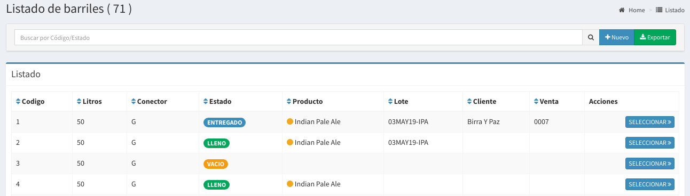
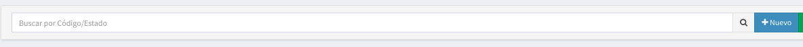
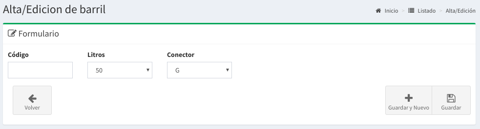

# Barriles

## Listado de Barriles

En esta pantalla se podrá observar todos los barriles activos y sus estados correspondientes.  Las columnas darán un detalle de los datos relevantes del barriles.

* **Código del barril**: un código numérico o alfanumérico para identificar al mismo.
* **Litros:**  Es la capacidad máxima de un barril.
* **Conector:** El mismo puede ser G,A,S,D,U,M.
* **Estado:** Lo explicaremos más adelante
* **Producto:** Acá mostrará el contenido de barril \(el producto\).
* **Lote:** En que Lote \(código de producción\) de Producto contiene.
* **Cliente:** Si estuviese entregado, en que Cliente se encuentra
* **Venta:** Si estuviese ASIGNADO o ENTREGADO en que venta esta.

## Estados

Los barriles pueden estar en diferentes estados, los mismos pueden ser:

* **SUCIO:**
  * El barril se encuentra en fábrica pero tiene que ser limpiado para su uso.
* **VACIO:** 
  * El barril se encuentra sin ningún producto en la fabrica.
* **LLENO:** 
  * El barril se encuentra lleno con un producto en la fabrica.
  * En este caso se podrá visualizar el producto
  * En este caso se podrá ver si fue envasado de un Lote
* **ASIGNADO:**  
  * El barril se encuentra lleno pero esta reservado para una venta.
  * En este caso se podrá visualizar a que venta esta asignado.
* **ENTREGADO:** 
  * El barril se encuentra fuera de la fabrica
  * En este caso se podrá ver que cliente lo tiene

## Búsqueda de Barriles

Por medio de la barra de búsqueda se podrá filtrar los barriles tanto por **código** como por el **estado** del mismo. Basta escribir un texto y apretar `Enter`

## `Nuevo Barril`

Basta hacer `click` a la derecha de la barra de búsqueda en el botón **'Nuevo'** para acceder al formulario para la creación de un nuevo barril.

Luego de esto aparecerá un formulario como el que sigue:

Completando los datos solicitados como el **código** \(numérico o alfanumérico\), la cantidad de **litros** \(capacidad\) y el **conector** podrá realizar `click` en Guardar.

De esta forma se creará un nuevo barril que estará en **estado** `VACIO`.

## Detalle del Barril

En el **listado de barriles** basta hacer `click` en el botón seleccionar del barril que queremos saber más información para que nos llevé a la pantalla de detalle.

A continuación se mostrará una pantalla como la siguiente:

En esta usted podrá saber todos los movimientos \(cambios de estado\) que ha tenido el barril que ha seleccionado.

