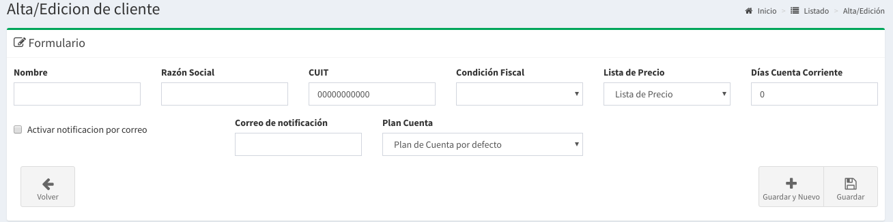
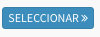

# Clientes

## Listado de Clientes

En esta pantalla se podrá observar todos los clientes activos. Las columnas darán un detalle de los datos relevantes de los clientes.

* **Cuit**: es el Cuit del Cliente
* **Nombre:**  Es el nombre de fantasía de un cliente
* **Razón Social:** Es el nombre legal del cliente.
* **Lista:** Es la lista de Precio por defecto del cliente
* **Días Cta Cte:** Es la cantidad de días que tiene en cuenta corriente.
* **Saldo:** Es la deuda total del cliente.

## Búsqueda de Clientes

Por medio de la barra de búsqueda se podrá filtrar los clientes tanto por **nombre** como por la **razón social** del mismo. Basta escribir un texto y apretar `Enter`

## Nuevo Cliente

Basta hacer `click` a la derecha de la barra de búsqueda en el botón **'Nuevo'** para acceder al formulario para la creación de un nuevo cliente.

Luego de esto aparecerá un formulario como el que sigue:

Para el mismo serán necesario completar los siguientes datos:

* **Nombre:** Nombre de fantasía de un cliente.
* **Razón Social:** Nombre legal de un cliente
* **CUIT:** Código único de identificación tributario
* **Condición Fiscal:** Tipo de inscripción fiscal
* **Lista de Precios:** Listado por defecto de precios.
* **Días Cuenta Corriente:** La cantidad de días que posee en la cuenta corriente.
* **Activar Notificación:** Si se activa todas las entregas se enviarán por email.
* **Correo de Notificación:** E-Mail de notificaciones. 
* **Plan de Cuenta:** Categoría del Plan de Cuenta por defecto.

Luego de completar los campos podrá realizar `click` en Guardar.

De esta forma se creará un nuevo cliente.

## Detalle del Cliente

En el **listado de cliente** basta hacer `click` en el botón seleccionar del cliente que queremos saber más información para que nos llevé a la pantalla de detalle.

A continuación se mostrará una pantalla como la siguiente:

En esta pantalla usted podrá registrar todos los locales que posea el cliente y además todos los contactos que tenga.

