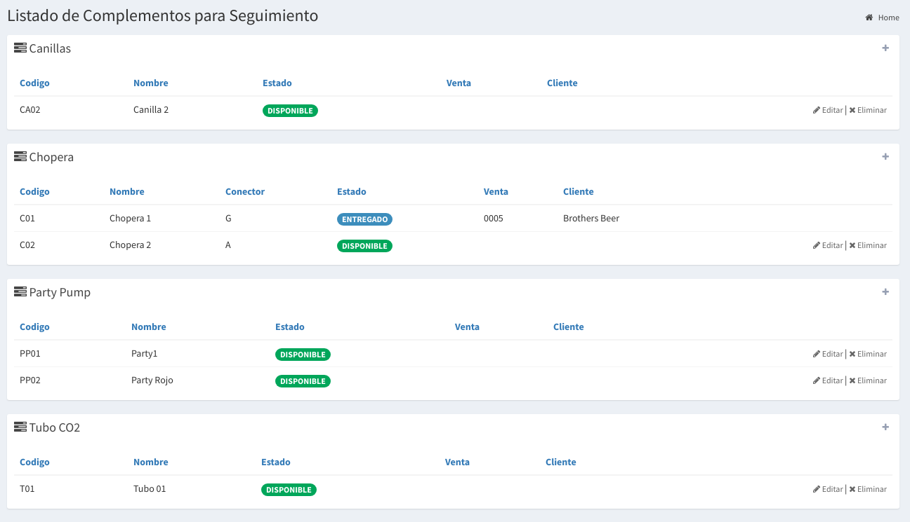
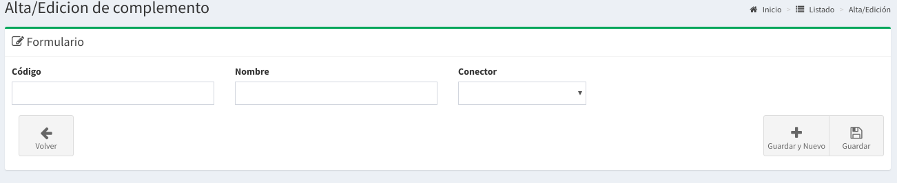

# Complementos

## Listado de Complementos

En este listado podrás cargar tus complementos, los mismos están agrupados por los nombres que se cargaron en Artículos \(con tipo Complemento/Tracking\).


Si cargamos un Artículo de tipo `Complemento` como "alquiler de chopera", entonces en esta pantallas podrías cargar todas las choperas que tenes.


La idea es que se cargué por ejemplo el Artículo "alquiler de chopera" como un complemento, entonces en esta pantallas podrías cargar todas las choperas que tenes.

Los datos que se muestran en el listados son un resumen de los datos relevantes de los complementos:

* **Código**: es el código del complemento
* **Nombre**: es el nombre del complemento.
* **Conector**: es el conector del complemento \(solo para choperas\).
* **Estado**: puede estar `DISPONIBLE`, `ASIGNADO` o `ENTREGADO`.
* **Venta**: la venta a la que esta asociada \(si esta `ASIGNADO` o `ENTREGADO`\)
* **Cliente**: si figura `ENTREGADO` es el cliente que tiene el complemento.

## Cargar nuevo complemento

Basta hacer `click` en el botón **+** en el costado derecho del recuadro para acceder al formulario de alta de un complemento.

Basta completar los datos de **código**, **nombre** y **conector** \(si es chopera\), y hacer `click` en **Guardar** para registrar el complemento.

