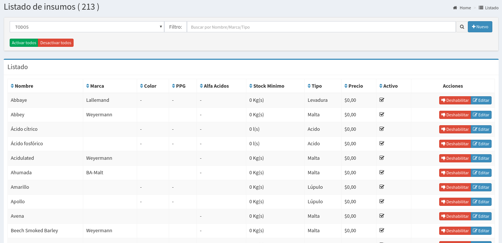
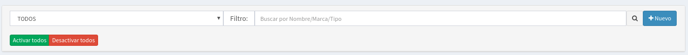

# Insumos

## Listado de Insumos

En esta pantalla se podrá observar todos los insumos disponibles. Las columnas darán un detalle de los datos relevantes de los insumos.

* **Nombre**: es el nombre del insumo
* **Marca:**  Es la marca del insumo.
* **Color:**  Solo aplica a Fermentables, es el color SRM/L
* **PPG:**  Solo aplica a Fermentables.
* **Alfa Ácidos:** Solo aplica a Levaduras
* **Stock Mínimo:**  Es una cantidad mínima de ese insumo. Si hay menos que eso activará una alarme en la pantalla inicial del sistema.
* **Tipo:**  Es el tipo del insumo \(Levadura, Malta, Lupulo, Envase, otros\)
* **Precios:** Es el precio de reposición del Insumo.

## Búsqueda de Insumos

Por medio de la barra de búsqueda se podrá filtrar los insumos tanto por **nombre** como por la **Tipo o Marca** del mismo. Basta escribir un texto y apretar `Enter`

También se permite filtrar por si esta activo o inactivo.

Los dos botones que mostramos a continuación

permite activar o desactivar todos los insumos.


Conviene activar solo los insumos que se utilizan para evitar errores en pantallas posteriores. De esta forma en las otras pantallas solo se mostrará los insumos activos. 


