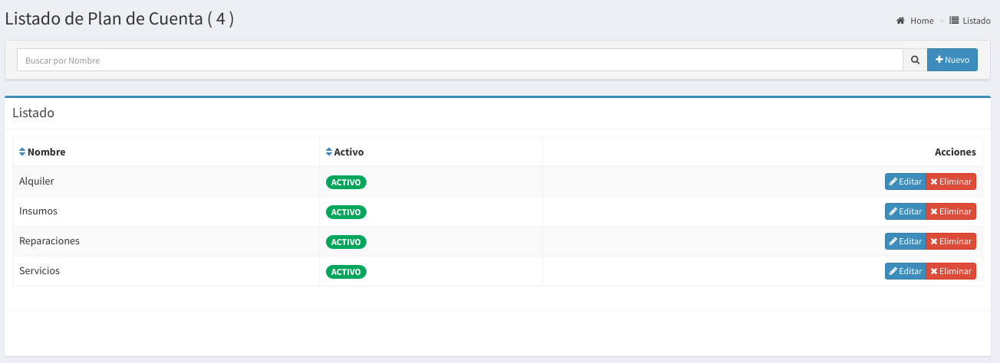
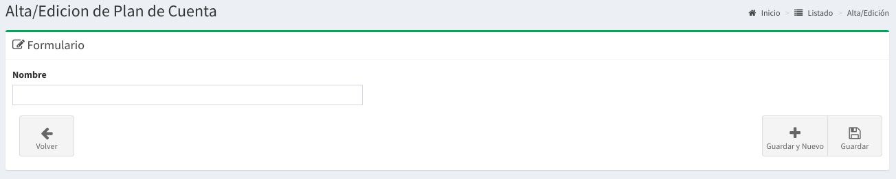

# Plan de Cuenta

## Listado de Plan de Cuenta

En esta pantalla se podrá observar todos los planes de cuentas disponibles  

## Búsqueda de Plan de Cuenta

Por medio de la barra de búsqueda se podrá filtrar los **planes de cuenta** por su **nombre.** Basta escribir un texto y apretar `Enter`

## Nuevo Plan de Cuenta

Basta hacer `click` a la derecha de la barra de búsqueda en el botón **'Nuevo'** para acceder al formulario para la creación de un nuevo plan de cuenta

Luego de esto aparecerá un formulario como el que sigue:

Los datos solicitados son:

* **Nombre:**  es el nombre del plan de cuenta

Luego de completar estos campos podrá realizar `click` en Guardar.

De esta forma se creará un nuevo plan de cuenta

## Editar un Plan de Cuenta

También podrá **editar** el plan de cuenta haciendo `click` en **Editar** en el **listado de plan de cuenta.**

## **Eliminar** un Tipo de Costo

También podrá **eliminar** el plan de cuenta haciendo `click` en **Eliminar** en el **listado de plan de cuenta.**

