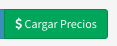

# Productos

## Listado de Productos

En esta pantalla se podrá observar todos los productos activos y sus estados correspondientes.  Las columnas darán un detalle de los datos relevantes del producto desde el punto de vista de la administración.

* **Código**: un nombre alfanumérico para identificar al mismo.
* **Nombre:** Es el nombre comercial con el que se vende el producto.
* **Estilo:** Es el estilo de la cerveza, el texto es descriptivo.
* **Tipo:**  
  * Fijo
  * Rotativo
  * Especial
* **IVA:**  Es la alícuota de IVA que aplica al producto.
* **Imp Interno:** Es la alícuota de otro tipos de impuestos.

## Búsqueda de Productos

Por medio de la barra de búsqueda se podrá filtrar los **productos** por su **nombre, código o estilo**. Basta escribir un texto y apretar `Enter`

## Nuevo Producto

Basta hacer `click` a la derecha de la barra de búsqueda en el botón **'Nuevo'** para acceder al formulario para la creación de un nuevo producto.

Luego de esto aparecerá un formulario como el que sigue:

Los datos solicitados son los siguientes:

* **Código:**  es un código corto \(alfanumérico\) del producto
* **Nombre Comercial:**  es el nombre con el que se vende el producto.
* **Estilo:** Es un texto libre para describir el estilo del producto
* **Tipo:** Es una categoría de productos con fines descriptivos
* **IVA:** Es la alícuota del impuesto de IVA
* **Imp.  Interno:** Es otra alícuota algunos países poseen un impuesto al alcohol.
* **Color:** Es un color para facilitar su lectura \(no es el color de la cerveza SRM\)
* **RNPA:** Es un código del producto creado para cuestiones alimentarías.
* **Nota de Cata:** Es una descripción del producto para mostrar a los bares que utilizan nuestras etiquetas QR externas.
* **Envases:** Los envases, además de los barriles, con que trabajan el producto dado.

Luego de completar estos campos podrá realizar `click` en Guardar.

De esta forma se creará un nuevo producto.

## Listas de Precios

En el **listado de productos** basta hacer `click` en el botón cargar precios para que el sistema te lleve directamente a las listas de precios.

Este tema sera explicado en Caja -&gt; Listas de Precios

## Editar un Producto

También podrá **editar** el producto haciendo `click` en **Editar** en el **listado de productos.**

## **Eliminar** un Producto

También podrá **eliminar** el producto haciendo `click` en **Eliminar** en el **listado de productos.**

