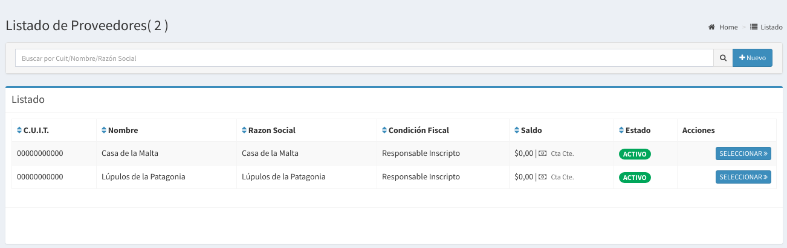
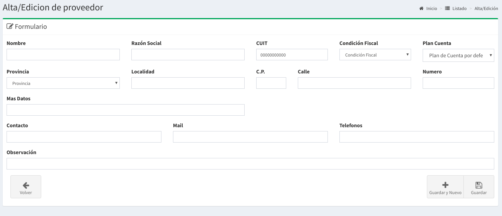
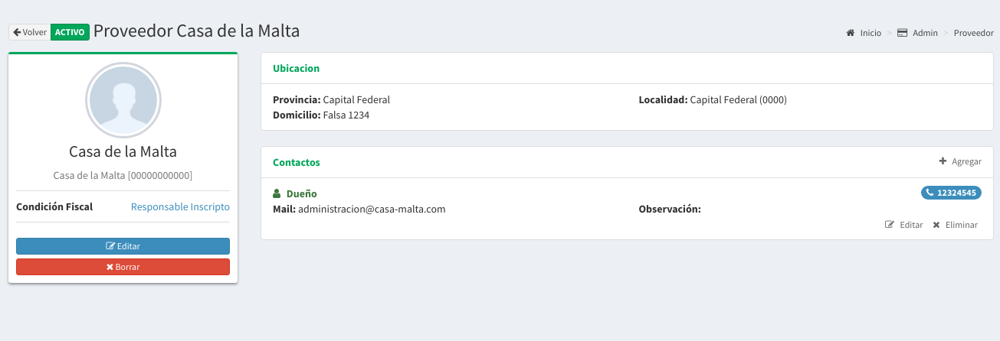

# Proveedores

## Listado de Proveedores

En esta pantalla se podrá observar todos los proveedores activos. Las columnas darán un detalle de los datos relevantes de los proveedores.

* **Cuit**: es el Cuit del Proveedor
* **Nombre:**  Es el nombre de fantasía del proveedor
* **Razón Social:** Es el nombre legal del proveedor.
* **Condición Fiscal:** Es el tipo de inscripción fiscal
* **Saldo:** Es la deuda total al proveedor.

## Búsqueda de Proveedores

Por medio de la barra de búsqueda se podrá filtrar los proveedores tanto por **nombre** como por la **razón social** del mismo. Basta escribir un texto y apretar `Enter`

## Nuevo Proveedor

Basta hacer `click` a la derecha de la barra de búsqueda en el botón **'Nuevo'** para acceder al formulario para la creación de un nuevo proveedor.

Luego de esto aparecerá un formulario como el que sigue:

Para el mismo serán necesario completar los siguientes datos:

* **Nombre:** Nombre de fantasía de un proveedor.
* **Razón Social:** Nombre legal de un proveedor
* **CUIT:** Código único de identificación tributario
* **Condición Fiscal:** Tipo de inscripción fiscal
* **Plan de Cuenta:** Categoría del Plan de Cuenta por defecto.
* Más otros datos de contacto y ubicación.

Luego de completar los campos podrá realizar `click` en Guardar.

De esta forma se creará un nuevo proveedor.

## Detalle del Proveedor

En el **listado de proveedores** basta hacer `click` en el botón seleccionar del proveedor que queremos saber más información para que nos llevé a la pantalla de detalle.

A continuación se mostrará una pantalla como la siguiente:

En esta pantalla usted podrá registrar todos los contactos que el proveedor disponga.

