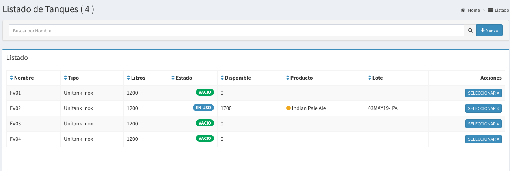
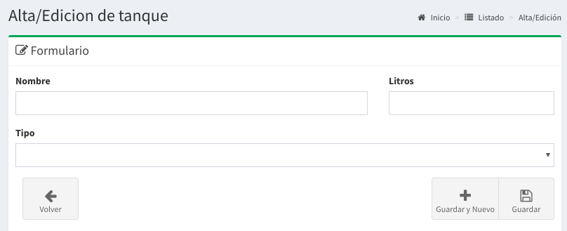
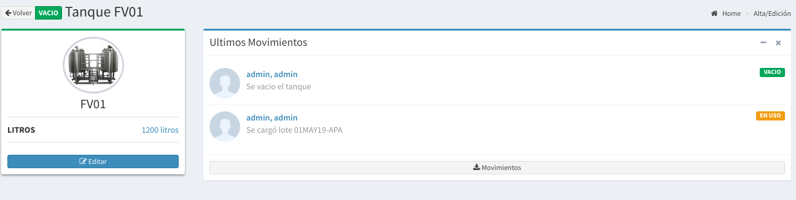

# Tanques

## Listado de Tanques

En esta pantalla se podrá observar todos los tanques activos y sus estados correspondientes.  Las columnas darán un detalle de los datos relevantes del tanque.

* **Nombre**: un nombre alfanumérico para identificar al mismo.
* **Tipo:**  
  * Unitank
  * Fermentador
  * Madurador
  * Barrica
* **Litros:**  La capacidad máxima del tanque
* **Estado:** Puede ser `VACIO` o `EN USO`
* **Disponibles:**  Litros aproximados que contiene en un momento dado.
* **Producto:** Acá mostrará el contenido de tanque \(el producto\).
* **Lote:** Con qué Lote de producto se encuentra lleno.

## Estados

Los tanques pueden estar en diferentes estados, los mismos pueden ser:

* **VACIO:** 
  * El tanque se encuentra sin ningún producto, es decir esta disponible.
* **EN USO:** 
  * El tanque se encuentra lleno con un producto.
  * En este caso se podrá visualizar el producto que contiene
  * En este caso se podrá qué lote de producto tiene.

\*\*\*\*

## Búsqueda de Tanques

Por medio de la barra de búsqueda se podrá filtrar los **tanques**  por su **nombre**. Basta escribir un texto y apretar `Enter`

## Nuevo Tanque

Basta hacer `click` a la derecha de la barra de búsqueda en el botón **'Nuevo'** para acceder al formulario para la creación de un nuevo tanque.

Luego de esto aparecerá un formulario como el que sigue:

Completando los datos solicitados como el **nombre** \(alfanumérico\), la cantidad de **litros** \(capacidad\) y el **tipo** podrá realizar `click` en Guardar.

De esta forma se creará un nuevo tanque que estará en **estado** `VACIO`.

## Detalle del Tanque

En el **listado de tanques** basta hacer `click` en el botón seleccionar del tanque que queremos saber más información para que nos llevé a la pantalla de detalle.

A continuación se mostrará una pantalla como la siguiente:

En esta usted podrá saber todos los movimientos \(cambios de estado\) que ha tenido el tanque que ha seleccionado

También podrá **editar** el tanque haciendo `click` en **Editar**.

