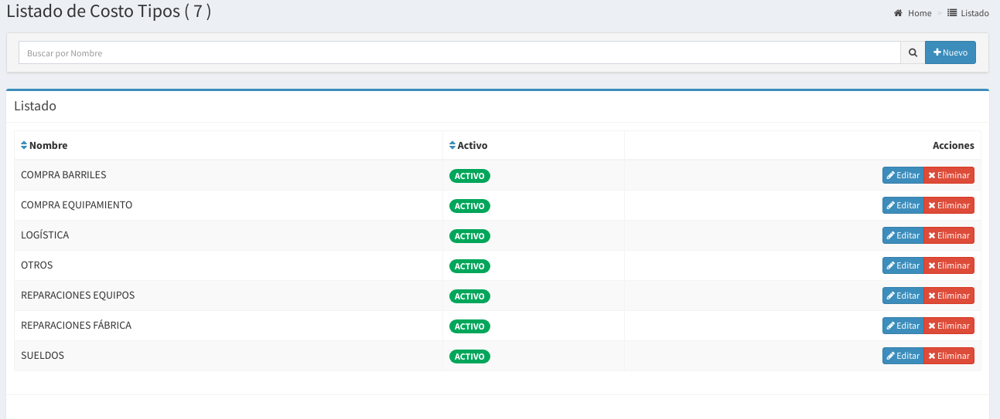
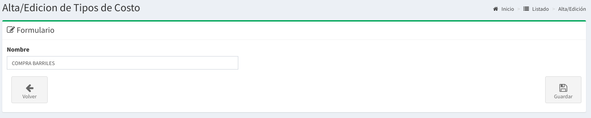

# Tipos de Costos

## Listado de Tipos de Costos

En esta pantalla se podrá observar todos los tipos de costos disponibles  

## Búsqueda de Tipos de Costos

Por medio de la barra de búsqueda se podrá filtrar los **tipos de costos** por su **nombre.** Basta escribir un texto y apretar `Enter`

## Nuevo Tipo de Costo

Basta hacer `click` a la derecha de la barra de búsqueda en el botón **'Nuevo'** para acceder al formulario para la creación de un nuevo tipo de costo.

Luego de esto aparecerá un formulario como el que sigue:

Los datos solicitados son:

* **Nombre:**  es el nombre del tipo de costo

Luego de completar estos campos podrá realizar `click` en Guardar.

De esta forma se creará un nuevo tipo de costo.

## Editar un Tipo de Costo

También podrá **editar** el tipo de costo haciendo `click` en **Editar** en el **listado de tipos de costos.**

## **Eliminar** un Tipo de Costo

También podrá **eliminar** el tipo de costo haciendo `click` en **Eliminar** en el **listado de tipos de costos.**

