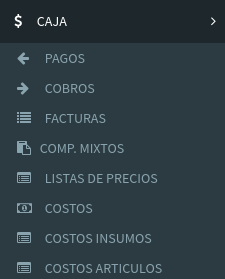

# Menú Web

## Accesos del menú Caja

El módulo **Caja** se compone de las siguientes pantallas:

* **Pagos**: Por acá podemos acceder al listado de pagos con la posibilidad de crear nuevos pagos
* **Cobros**: Por acá podemos acceder al listado de cobros con la posibilidad de crear nuevos cobros
* **Facturas**: Es el listado de Facturas emitidas que están asociada tus ventas
* **Comp. Mixtos:** El listado de Cobros y Devoluciones con sus comprobantes.


Esta pantalla solo se muestra en los usuarios que tengan habilitado Cobros y Devoluciones en Simultaneo. Es una mezcla de funciones de Caja y Seguimiento. No es recomendado!.


* **Listas de Precios:** acá podrás ver todas las listas de precios y editar sus datos
* **Costos:** acá veras todos los costos asociados 
* **Costos Insumos:** acá podrás cargar los precios de tus insumos
* **Costos Artículos:** acá podrás cargar los precios de tus artículos

## Pagos

Para más información vaya al siguiente link:



## Cobros

Para más información vaya al siguiente link:



## Facturas

Para más información vaya al siguiente link:



## Comprobantes Mixtos

Para más información vaya al siguiente link:



## Listas de Precios

Para más información vaya al siguiente link:



## Costos

Para más información vaya al siguiente link:



## Costos de Insumos

Para más información vaya al siguiente link:



## Costos de Artículos

Para más información vaya al siguiente link:



