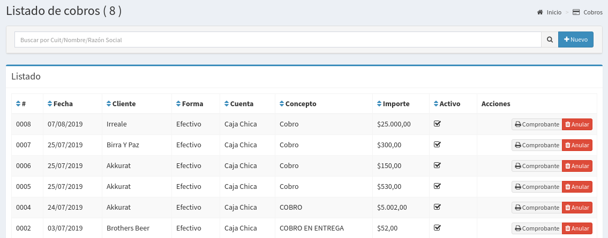
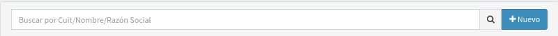
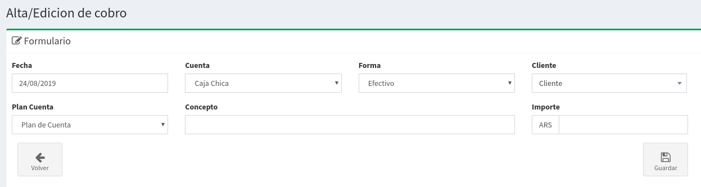

# Cobros

## Listado de Cobros

En esta pantalla se podrá observar todos los cobros realizados y sus estados correspondientes.  Las columnas darán un detalle de los datos relevantes de los cobros.

* **Fecha**: el la fecha asociada al cobro
* **Cliente:**  es el cliente al que se realizo el cobro
* **Forma:**  Es la forma de pago.
* **Cuenta:** Es la cuenta desde donde se cargo el cobro.
* **Concepto:**  Concepto asociado al cobro.
* **Importe:** Importe cobrado
* **Activo:** Si el cobro esta activo o `Anulado`

## Búsqueda de Pagos

Por medio de la barra de búsqueda se podrá filtrar los **cobros**  por su **cuit, nombre o razón social**. Basta escribir un texto y apretar `Enter`

## Nuevo Cobro

Basta hacer `click` a la derecha de la barra de búsqueda en el botón **'Nuevo'** para acceder al formulario para la creación de un nuevo pago.

Luego de esto aparecerá un formulario como el que sigue:

Completando los siguientes datos solicitados :

* **Fecha:** Es la fecha en que se imputa el cobro
* **Cuenta**: Es la cuenta desde donde se reciben los fondos
* **Forma**: Es el medio de pago
* **Cliente**: El cliente al que se realiza el cobro
* **Plan de Cuenta:** Es un identificador para agrupar movimientos de cuentas
* **Concepto**: Es una descripción del cobro a realizar
* **Importe**: Es el importe que se va a cobrar.

Luego de eso podrá realizar `click` en Guardar. Esto generará dos cosas:

* Un ingreso de dinero en la cuenta seleccionada
* Un egreso de dinero en la cuenta corriente del cliente.

