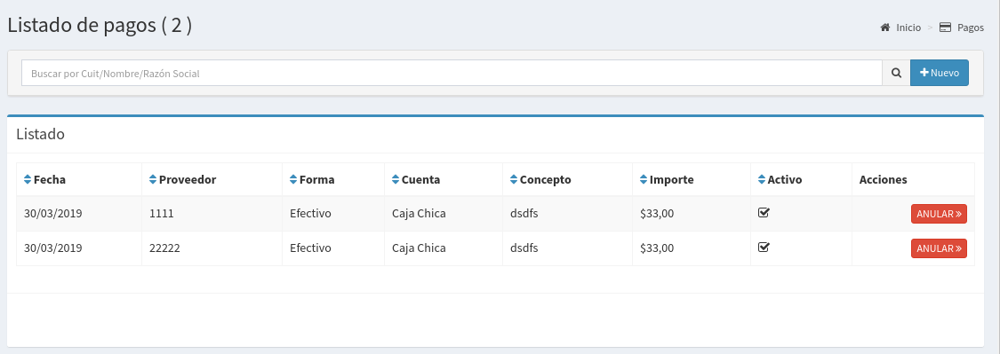
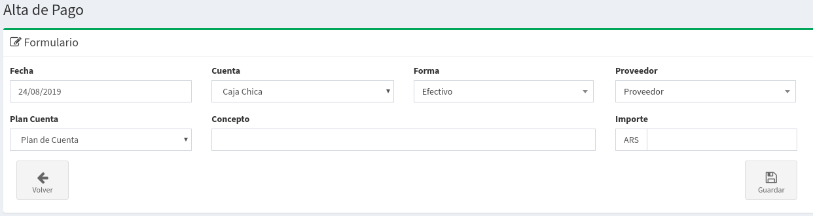

# Pagos

## Listado de Pagos

En esta pantalla se podrá observar todos los pagos realizados y sus estados correspondientes.  Las columnas darán un detalle de los datos relevantes de los pagos.

* **Fecha**: el la fecha asociada al pago
* **Proveedor:**  es el proveedor al que se realizo el pago
* **Forma:**  Es la forma de pago.
* **Cuenta:** Es la cuenta desde donde se realizó el pago.
* **Concepto:**  Concepto asociado al pago.
* **Importe:** Importe del pago
* **Activo:** Si el pagó esta activo o `Anulado`

## Búsqueda de Pagos

Por medio de la barra de búsqueda se podrá filtrar los **pagos**  por su **cuit, nombre o razón social**. Basta escribir un texto y apretar `Enter`

## Nuevo Pago

Basta hacer `click` a la derecha de la barra de búsqueda en el botón **'Nuevo'** para acceder al formulario para la creación de un nuevo pago.

Luego de esto aparecerá un formulario como el que sigue:

Completando los siguientes datos solicitados :

* **Fecha**: Es la fecha en que se imputa el pago
* **Cuenta**: Es la cuenta desde donde salen los fondos
* **Forma**: Es el medio de Pago
* **Proveedor**: El proveedor al que se realiza el pago
* **Plan de Cuenta**: Es un identificador para agrupar movimientos de cuentas
* **Concepto**: Es una descripción del pago a realizar
* **Importe**: Es el importe que se va a pagar.

Luego de eso podrá realizar `click` en Guardar. Esto generará dos cosas:

* Un egreso de dinero en la cuenta seleccionada
* Un ingreso de dinero en la cuenta corriente del proveedor.

