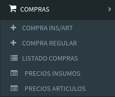

# Menú Web

## 01\) Compras de Insumos / Artículos

Son compras que además de registrar la deuda con los proveedores también sirven para incrementar el stock de los Insumos y/o los Artículos.



## 02\) Compras Regulares

Son compras que registran deuda con los proveedores y tiene como principal funcionalidad cargar los comprobantes asociados.



## 03\) Listado de Compras

Listado de todas las compras realizadas a los distintos proveedores



## 04\) Precios de Insumos

En esta sección se puede ir actualizando el precio de reposición de los insumos.

Son tenidos en cuenta a la hora de ir calculando el costo de los Lotes



## 05\) Precios de Artículos

En esta sección se puede ir actualizando el precio de reposición de los artículos.



