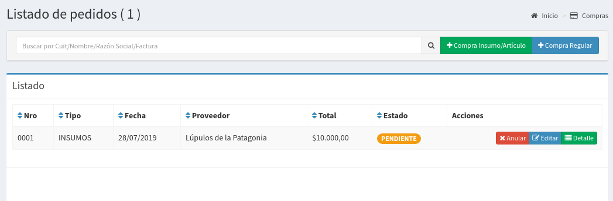
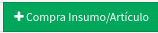
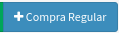

# Listado

## Listado de Compras

  
En esta pantalla se podrá observar todas compras realizadas. Las columnas darán un detalle de los datos relevantes de las ventas.‌

* **Nro**: es el número interno asociado a una compra
* **Tipo**: es el tipo de la compra, puede ser General o de Insumos ya lo explicaremos a continuación
* **Fecha**: es la fecha de la compra
* **Proveedor**: se muestra la razón social del proveedor
* **Total**: es importe a pagar al proveedor
* **Estado**: es estado de la compra, puede ser Pendiente, Entregada o Finalizada

## Tipos de Compras

Existen dos tipos de compras

* **De insumos o artículos:** son compras que tiene además de generar deuda con el proveedor también van a generar un incremento en el Stock de Insumos y/o Artículos.

Utilizando el siguiente botón se podrá crear una compra de Insumos y/o Artículos

Para más información puede consultar el siguiente enlace:



* **Regulares:** son compras a proveedores que se registran para ir llevando la cuenta corriente con los proveedores pero que no involucran un alta de Stock de Insumos o Artículos.

Utilizando el siguiente botón se podrá crear una compra Regular

Para más información puede consultar el siguiente enlace:



