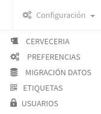

# Menú Web

Este módulo esta pensado para que lo use el administrador del sitio

## 1. Cervecería

En esta sección se pueden cargar los datos de la cervecería, incluyendo el logo para remitos y la imagen que se muestra en el acceso al sistema



## 2. Preferencias

En esta sección existen varias configuraciones para habilitar a o des-habilitar algunas de las configuraciones opcionales del sistema.



## 3. Migración de Datos

Esta sección esta orientada a dar los primeros pasos de la manera más rápido posible.

Se puede a partir de unas planillas de calculo inicializar el sistema



## 4. Etiquetas

En esta sección podrás generar las etiquetas QR que recomendamos para realizar un correcto tracking de barriles. 



## 5. Usuarios

En esta sección podrás de dar de alta o editar los diferentes usuarios de tu sistema.

También contiene un listado de permisos para limitar el acceso de algunos usuarios.



