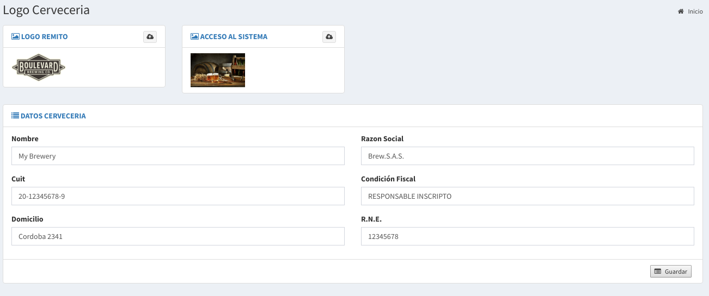

# Cervecería

## Datos de la cervecería

En esta sección se permite cambiar:

* El logo que se imprime en los remitos de ventas y en otros comprobantes.
* El imagen que se ve en el acceso al sistema.

También nos permite ingresar los siguientes datos:

* **Nombre**
* **Razón Social**
* **Cuit**
* **Condición Fiscal**
* **Domicilio**
* **RNE**

Todos estos datos tiene como objetivo completar los datos para la impresión de remitos u otros comprobantes.

