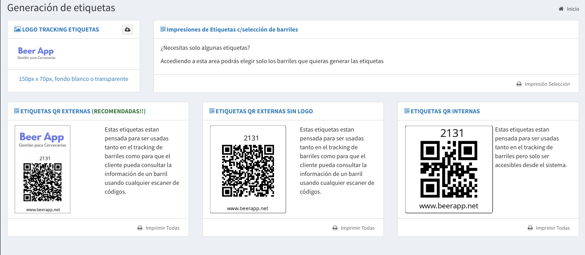
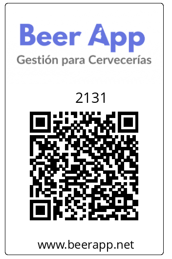

# Etiquetas

## Configuración de Etiquetas

En esta pantalla podes subir **tú** **logo** y generar todas las etiquetas \(o las que necesites\) en un PDFs para mandar a la imprenta.


Recomendamos que se utilicen materiales de buena calidad para maximizar la durabilidad de las mismas.

Sugerimos que se impriman en vinilo barnizado o como algún tratamiento anti-humedad pensando en las condición que están expuestos los barriles en los clientes.



Recordá que tenes que tener tus barriles cargados para generar las etiquetas


La función de las etiquetas es facilitar la carga de barriles en todo el proceso de de tú fábrica _**desde el llenado a hasta la entrega y devolución del cliente**_. De esta forma se evitan los errores que sé pueden dar al escribir el código de barriles.

## Tipos de Etiquetas

Existen dos tipos de etiquetas:

* **Internas**: Sirven para todo el proceso de gestión de barriles del sistema
* **Externas/Collarín:**  Además de hacer lo mismo que las **internas**, también permiten que sean utilizadas como Collarín digital. Es decir tus bares podrán saber el producto que posee y sus características \(ABV, IBU, SRM, notas de cata\). Estas son las **recomendadas** por nosotros.

Las **Externas/Collarín** también permiten poner tu propio logo.

