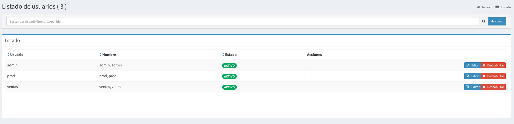
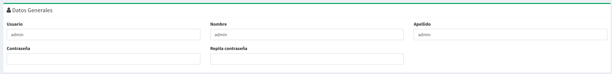
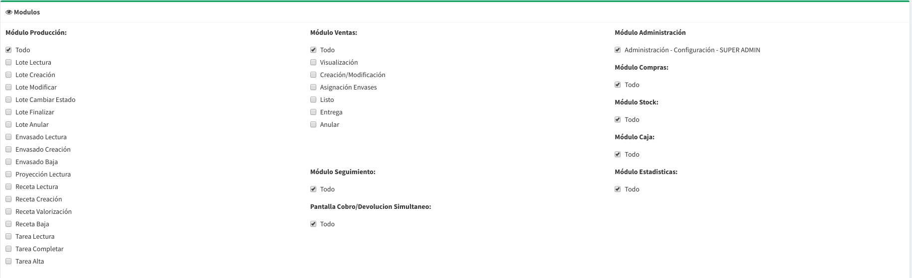

# Usuarios

## Listado de Usuarios

Acá podrá visualizar todos los usuarios creados y además ofrece la posibilidad de:

* Creación de un nuevo usuario, utilizando el botón Nuevo.
* Edición de un usuario  ya existente, por medio del botón editar.
* Deshabilitar un usuario

## Creación de Usuario / Edición de Usuario

Este formulario contiene los datos básicos de un usuario,  los mismos son:

* **Usuario**: Es el nombre con que se accede a la aplicación.
* **Nombre**: Nombre del usuario
* **Apellido**: Apellido del usuario
* **Contraseña**: Es la contraseña con la que se accede a la aplicación.


Si esta editando un usuario y no completa la contraseña se mantendrá la misma que estaba.


### Permisos

A continuación explicaremos los permisos según cada módulo.


Podrá editar los permisos todas las veces que sea necesario.


## Módulo Producción

* **Admin:** Todas las opciones de abajo y algunos permisos especiales sobre revertir acciones.
* **Lote Lectura:** Permite visualizar la información de los lotes.
* **Lote Creación:** Alta y modificación de la cabecera del Lote.
* **Lote Modificar:** Modificar insumos, cargar trazabilidad de insumos.
* **Lote Cambiar Estado:** Permite Comenzar la cocción e ir cambiando las etapas de un lote
* **Lote Finalizar:** Permite finalizar el lote.
* **Lote Anular:** Permite anular el lote.
* **Envasado Lectura:** Permite visualizar la información de lo envasado.
* **Envasado Creación:** Llenado de barriles y envases.
* **Envasado Baja:** Revertir llenado de barriles y envases
* **Proyección Lectura:** Permite visualizar la proyección de insumos en base a lotes planificados y compras pendientes
* **Receta Lectura:** Permite visualizar las recetas.
* **Receta Creación:** Permite la alta/modificación de recetas.
* **Receta Valorización:** Permite acceder a la valorización de los insumos de la receta.
* **Receta Baja:** Permite eliminar una receta.
* **Tarea Lectura:** Permite visualizar las tareas y grupos de tareas.
* **Tarea Completar:** Permite completar las tareas asociadas a un lote. 
* **Tarea Alta:** Permite la alta/modificación y anulación de tareas.


Si no necesita permisos detallados basta poner **Admin**, y tendrá acceso a todas las funcionalidades


## Módulo Ventas

* **Admin:**  Contiene todas las opciones listadas abajo.
* **Visualización:** Permite la visualización de las ventas
* **Creación/Modificación:**  Directa, Pedido Alta, Pedido Edición
* **Asignación Envases:** asignar y borrar envases \(no detalles\),  marcar `Listo`
* **Revertir listo:**  Permite volver a estado `Pendiente` una venta en estado `Listo`
* **Entrega:**  Permite Entregar una venta, asociarle un cobro,  asociarle devoluciones, enviar remito y firmar.
* **Anular:**  Permite Anular una venta Lista o Pendiente.


Si no necesita permisos detallados basta poner **Admin**, y tendrá acceso a todas las funcionalidades


## Próximamente

En las próximas versiones iremos agregando los permisos del resto de los módulos.

