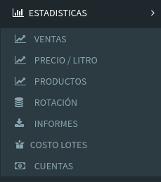

# Menú Web

## 1. Ventas

Este informe muestra la evolución de 

* Ventas
* Cobros
* Facturación
* Descuentos

a lo largo de los distintos meses.

Además permite hacer `click` en el periodo y ver el detalle de los mismos.

## 2. Precio / Litro

Este informe tiene en cuenta lo siguiente

* Litros Vendidos
* Precio Promedio de Ventas
* Litros Envasados
* Costos de Insumos asociados a esos litros
* Costos fijos de ese periodo

## 3. Productos

## 4. Rotación

## 5. Informes

## 6. Costos Lotes

## 7. Cuentas

