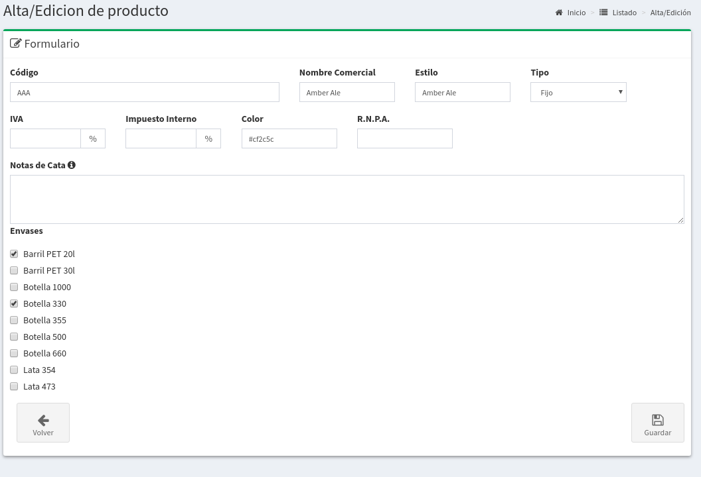
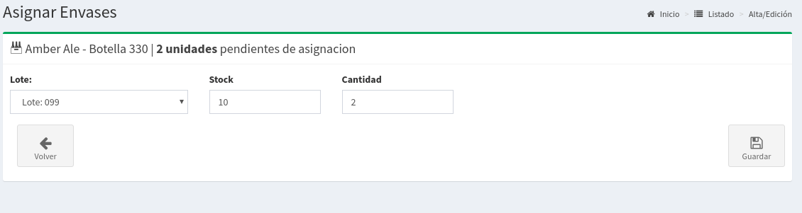

# Ventas de Otros Envases

## Habilitar los nuevos envases

Lo primero que tenemos que hacer es ir a la pantalla de Administración de Productos.

Vamos a poner `Editar` en la cerveza Amber Ale, y a continuación veremos la pantalla de edición que nos permitirá elegir los envases con los que trabajamos.

En nuestro caso seleccionamos 2 envases:

* Barril PET 20l
* Botellas 330

De esta forma le decimos al sistema que vamos a trabajar con estos envases, así nos va a permitir tanto envasar Amber Ale con estos envasas y también asignarles un precio en nuestras listas de precios.


Recordá que no podrás vender ningún envase hasta que tengas asociado el precio del mismo.


## Envasado de Otros Envases 

Luego de haber habilitado los envases en el estilo Amber Ale iremos a la pantalla de Envasado y mostraremos como envasar los mismos desde un Lote que ya tenemos creado.

Para estos nos dirigimos a `Producción => Envasado.`

Seleccionamos el Lote de Amber Ale, en nuestro caso el lote 099 y veremos lo siguiente:

Esta pantalla esta compuesta de varias pestañas internas:

* **Barril Propio:** Para cuando envasamos nuestros barriles
* **Barril Externo:** Para los barriles que pertencen a los clientes
* **Envases:** Para envases diferentes a barriles

Nosotros hacemos `Click` en `Envases` y podremos ver el siguiente formularios. Donde vamos a poder seleccionar los Envases que habilitamos antes.

Podemos agregar todos los envases que necesitemos utilizando el botón `Agregar`. Luego cuando hayamos seleccionado todos podremos ver el listado


No olviden de poner Envasar así se registra el envasado de los items que aparecen en la tabla.


En este momento no solo tenemos habilitado los envases sino que ya tenemos stock cargado!

## Listas de Precios

El paso anterior a poder vender nuestros productos sean Barriles u Otros Envases es cargar los precios en nuestras listas de precios.

Basta ir a Ventas =&gt; Listas de Precios y elegir la que queremos modificar para agregar el precios a nuestros nuevos envases.

Por ejemplo si pusimos Cargar Precios sobre una de estas listas vamos a ver lo siguiente:

Elegimos el precio asociado a nuestro Barril PET 20l y a nuestras Botellas de 330 y ya estamos listos para poder venderlas.


* Recordá poner Guarda Precios luego de editar la planilla
* El precio de los Envases que no son Barriles de Acero, es por unidad no por litro.


## Ventas con Envases

Ahora estamos en condiciones de cargar una con envases. Creamos un Pedido como es habitual y veremos la pantalla de con el detalle del Pedido.

Si seguimos todos los pasos correctamente y la venta usa la `Lista de Precios` que actualizamos el precios de los envases. En el desplegable de `Producto` veremos que además de los precios de Barriles figuran los envases que cargamos al principio.

De esta forma podremos ir cargando nuestros Envases de la misma manera que la carga de barriles

Esto daría de alta el pedido, luego faltaría asociar ese pedido con los envases que envasamos con anterioridad. Hay que tener en cuenta que hay dos posibilidades para Envases \(Botellas, Latas, PETs\) en lo que refiere a la **Asignación** de los mismos.

* **Stock Propio:** Vamos a utilizar envases que ya tenemos en nuestro Stock
* **Sin Asignar:** No queremos seguir ningún control solo que figure en el Remito, pero no va modificar el mi stock.

Lo normal es utilizar nuestros envasados y descontar el stock, pero podría pasar que por algún motivo puntual no se quiera modificar el stock.

Una vez cargado el detalle del pedido veremos algo similar a esto.

Y más abajo podremos ver el listado de Asignaciones pendientes que tenemos, se marcar con un Cruz los items que todavía no están asignados.

Si tocamos el botón Asignar podremos ir a una pantalla que nos permitirá asignar los envases solicitados a partir de nuestro stock.

Ahí se podrá elegir de que Lote se asignan los envases y que cantidad. De esta manera sabremos que a donde fue vendido todo nuestro lote, más allá de si fue en Barriles, Latas, Botellas o PETs.

Una vez asignado todos los envases veremos que todos figuran con un tilde, y en el costado derecho veremos el mensaje 

Ahora estamos en condiciones de poner la venta como **Lista** para su posterior entrega

