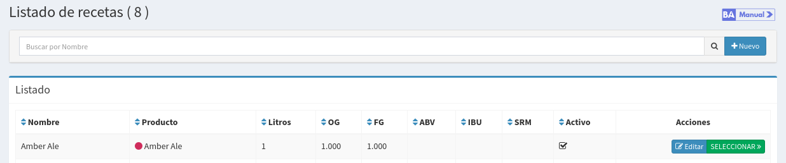
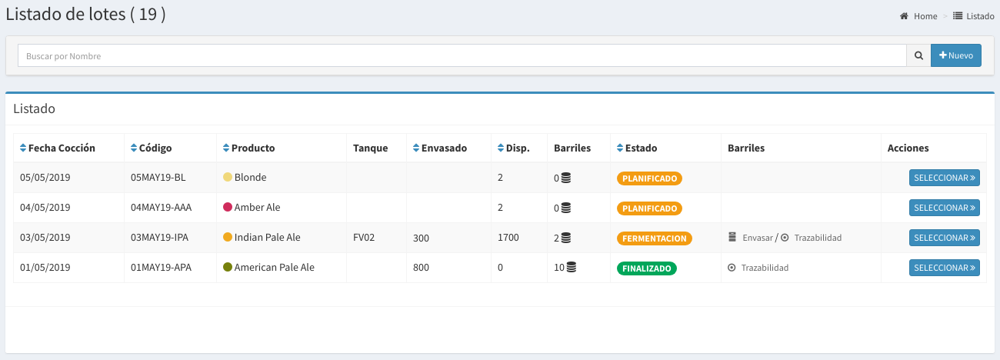
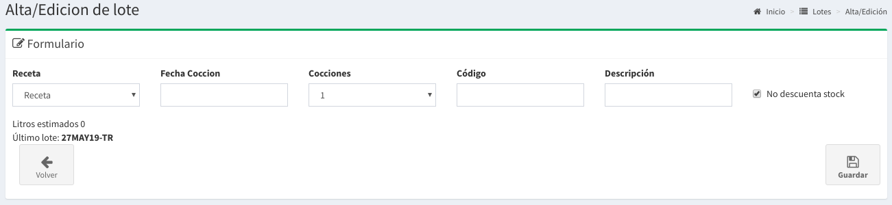
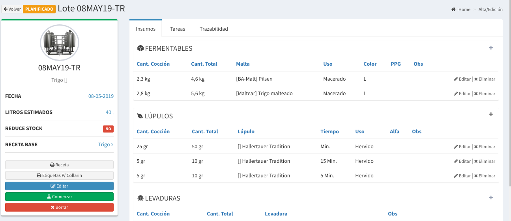
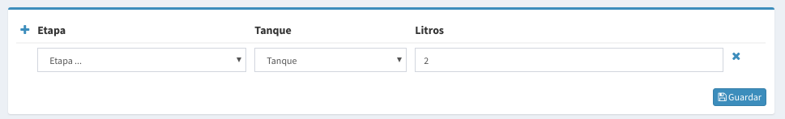

# Primera Cocción

## Introducción

Asumimos que ya tenes cargado un producto en el sistema, si no es el caso podes ver la guia de primeros pasos



Cuando cargas un producto automáticamente se genera una **Receta** con el mismo nombre.

Supongamos que tenemos cargado una cerveza **Amber Ale**, si nos dirigimos a `Producción => Receta` podremos ver lo siguiente

Aquí se puede ver la receta base que se crea automáticamente al crear un producto.

## Edición de Receta

Las recetas esta compuesta por dos partes

* Datos Generales
* Insumos

Por ahora empecemos a cargar los datos generales de la receta, para esto hacemos `click` en el botón **Editar**.

A continuación podremos completar los datos generales, en especial un dato relevante que sugerimos completar es el de **Litros**, dado que este se utiliza para ir estimando los litros de un Lote.

Luego de eso si nos interesa podemos también ir cargando los insumos de las recetas, utilizando el botón **Seleccionar**. Esto nos permitirá llevar un control de stock de insumos utilizados.

Para ver más información sobre las recetas se puede acceder al siguiente link.



## Creación de Lote

En este punto, tenemos tanto nuestro producto **Amber Ale** como también los datos de nuestra Receta base.

Nos dirigimos a **Producción =&gt; Lotes**, y aquí tendremos la posibilidad de crear uno nuevo. Lo primero que veremos es el listado de Lotes.

Para crear un nuevo **Lote** basta hacer `click` a la derecha de la barra de búsqueda en el botón **'Nuevo'** .

Luego de esto aparecerá un formulario como el que sigue:

Los campos a completar son los siguientes:

* **Receta**: es el nombre de la receta base que vas a seguir.
* **Fecha Cocción**: es la fecha de inicio de cocción.
* **Cocciones**: es la cantidad de cocciones que vas a realizar
* **Código**: es el código de lote utilices
* **Descripción**: descripción si es necesario.
* **No descuenta stock?**: Si se activa, no sé descontará los insumos de tu stock.


Si no manejas el stock por sistema aún o es una cocción con insumos que no están en el stock. Podes tildar la opción de **no descuenta stock**



Teniendo en cuenta los **litros** estimados de la receta y la cantidad de **cocciones** podemos estimar lo siguiente

**`litros_estimados = cocciones * litros_receta`**



Lo mismo pasa con los **insumos**, se multiplicará los insumos por la cantidad de **cocciones**.


Luego podes poner `click` en **Guardar** y se guardará tu **lote** el mismo quedará como `PLANIFICADO`.

## Detalle del Lote

En el **listado de lotes** basta hacer `click` en el botón **seleccionar** del lote que queremos saber más información para que nos llevé a la pantalla de detalle.

A continuación se mostrará una pantalla como la siguiente:


Acá podrás ver que se **copiaron** todos los **insumos** de la receta base.



Cualquier modificación de los insumos **no se verá reflejada en la Receta.** Si algún insumo no tenes stock podes cambiarlo por otro si tocar la receta base


Podrás realizar todas las modificación que gustes y cuando sea el día de la cocción deberás hacer `click` en el botón **Comenzar**


En este momento si tenias habilitado la opción se descontarán todos los insumos utilizados


## Registrar en qué Tanque se guarda un Lote

Una vez terminada la **cocción** o la primera cocción tendrás la posibilidad de camiar el estado al lote que actualmente esta `EN COCCIÓN.`

Esto lo podes realizar ingresando al **Detalle de Lote**, ahí podrás ver este formulario:

Los campos necesarios son los siguientes

* **Etapa:** podrás elegir una etapa descriptiva de en que proceso se encuentra el lote.
* **Tanque:** tenes que elegir a que tanque vas a mandar tu cerveza
* **Litros:** acá podes ir puliendo los litros estimados que hay en el tanque.


El sistema validará que el Tanque este **VACIO** antes de asignarlo.



Si divides un lote en varios tanques podes hacer `click` en el **+** en la esquina superior izquierda para agregar otro tanque.



Recuerda que cuando sale de cocción siempre tendrá que estar en, al menos, 1 tanque hasta su finalización.


Desde ahora hasta que finalices el lote tendrás disponibles las opciones de envasar o embarrilar.

## Envasado

Una vez finalizada la fermentación y la maduración es el momento de pasar tu cerveza sus respectivos envases, para esto existe la pantalla Producción =&gt; Envasado la que te permitirá ir sacando litros del Tanque y pasarlo a Envases de distintas formas:

* Envasarlo a barriles Propios
* Envasarlo a barriles Externos \(Barriles que no te pertenecen y no tenes cargado en tú sistema\)
* Otros Envases \(Lates, Botellas, PETs, etc\)

Para ver un poco más sobre como se realiza el envasado te sugerimos ver el siguiente enlace.



Cuando ya todo este envasado y quieras liberar todos los fermentadores deberás finalizar el lote.

## Finalizar un Lote

Cuando **no haya más que envasar** y los tanques estén vacíos de este Lote lo que tienes que hacer es finalizarlo.


Atención luego de finalizar ya no se podrá seguir envasando.



Todo lo que ya envaso seguirá igual, solo no se podrá envasar más


Al finalizar se recolectan estadísticas como cuantos litros reales se envasaron para su posterior uso.

Desde este momento todos los Tanques asociados pasaran a estar `Vacio` y se podrán usar para otro Lote.

