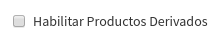
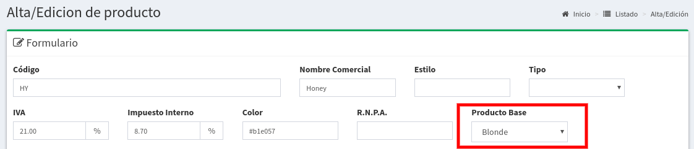
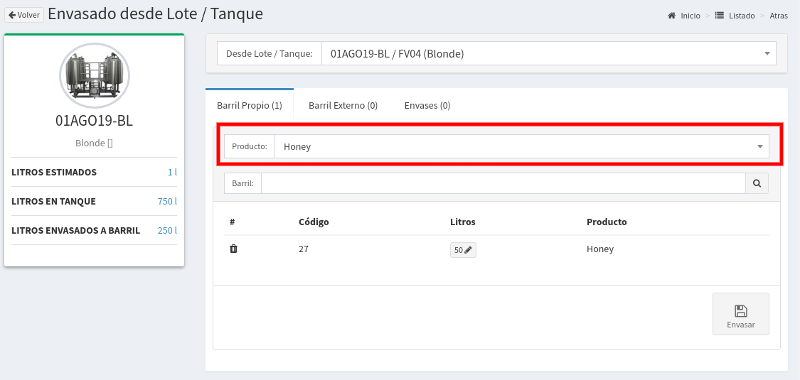
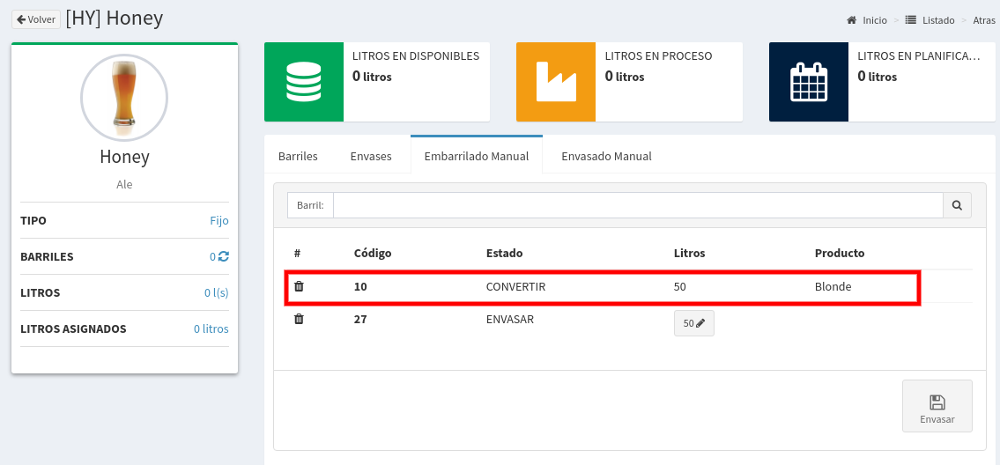

# Productos Derivados

## Introducción

Imaginemos que producimos una cerveza **Honey** pero utilizando como cerveza **base** una **Blonde**.

El sistema permite mediante una configuración especial realizar este tipo de tareas, lo primero que tenemos que hacer es tildar esta configuración. 

Accedamos en el menú de Configuraciones

y luego vamos a la opción Preferencias.

A continuación en la sección de **Producción** veremos la siguiente configuración.

la tildamos y ponemos `Guardar`.

## Creación de Producto Derivado

Asumimos que ya tenemos el producto **Blonde** creado \(nuestro producto base\), ahora vamos a crear el producto derivado **Honey**. Para esto vamos a `Administración => Productos` y ponemos el boton `Nuevo`.

En este formulario si activamos la configuración del paso anterior veremos un nuevo campo **Producto Base,** en el mismo podremos seleccionar cualquier de nuestros productos cargados. En nuestro caso seleccionamos la **Blonde**.

A partir de ahora ya tenemos hecha la relación solo nos queda mostrar como se envasa desde una **Blonde** a una **Honey**.


Recuerda carga el precio en las listas de precios antes de vender, sino el sistema no te permitirá venderla.


## Envasado desde un Lote/Tanque

El procedimiento es igual al envasado convencional, solo que luego de habilitar la configuración el sistema nos permitirá elegir el producto final.

Imaginemos que tenemos un lote de **Blonde** y queremos registrar un envasado de una **Honey** debido a que le agregamos miel en el envasado.

Vamos a `Producción => Envasado` y veremos el lote de **Blonde** pero podremos elegir que producto envasar entre los que se pueden derivar. En nuestro caso elegimos **Honey**, el barril y luego `Envasar`.

## Convertir un Barril de Blonde a Honey

Si es el caso que realizan la conversión sobre el barril la se puede registrar este cambio de la siguiente manera. Vamos a la pantalla `Stock => Ajuste x Producto` y seleccionamos el producto **Honey**.

A continuación podremos tanto dar de alta manualmente barriles como también convertir a **Honey** cualquier barril con un producto base.

En este caso el barril Nro 10 tenía una cerveza **Blonde** y el sistema nos permite seleccionarlo. Al apretar el botón `Envasar`, se producirá la conversión del barril que pasará de **Blonde** a **Honey**.

