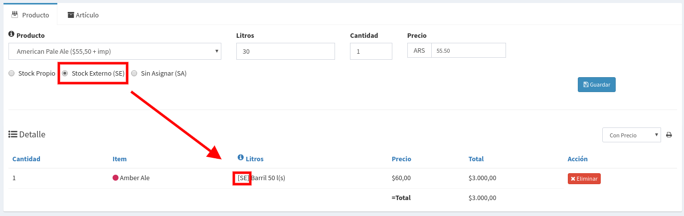

# Ventas con Barriles Externos

## Objetivos

Los **Barriles Externos** son barriles que no son propios, el caso más común se da cuando los clientes tienen barriles de ellos y los dan a las fabricas para que los llenen.

Lo que vamos a mostrar a continuación tiene dos objetivos:

* **Registrar el Envasado** para que descuente los litros correspondiente en nuestro Stock
* Registrar que los Barriles fueron entregados, y mantener la **trazabilidad de nuestra cerveza** desde los Insumos hasta el Cliente.

## Envasado de Barriles Externos

Para comenzar con la Venta de Barriles Externos, primeros necesitamos llenar los barriles.

Para estos nos dirigimos a `Producción => Envasado.`

Seleccionamos un Lote en nuestro caso es una Amber Ale lote 099 y veremos lo siguiente:

Esta pantalla esta compuesta de varias pestañas internas:

* **Barril Propio:** Para cuando envasamos nuestros barriles
* **Barril Externo:** Para los barriles que pertenecen a los clientes
* **Envases:** Para envases diferentes a barriles

Nosotros hacemos `Click` en `Barril Externo` y podremos ver el siguiente formulario. Donde vamos a poder cargar los barriles del cliente.

Lo primero que debemos hacer es seleccionar el cliente al que le pertenecen, luego el código o numeración propia del barril o una descripción y por ultimo la cantidad de litros a envasar. No olvidar de presionar el botón `Agregar`para que aparezca en el listado. 

Luego cuando hayamos cargado todos los barriles veremos el detalle en la tabla de abajo


No olviden de poner Envasar así se registra el envasado de los items que aparecen en la tabla.


Ya tenemos stock externo asociado al Cliente cargado, ahora solo resta generar la venta.

## Ventas con Barriles Externos

Ahora estamos en condiciones de cargar una con barriles externos. Creamos un Pedido como es habitual y veremos la pantalla con el detalle del Pedido.

Ahora podemos cargar los productos, pero en lugar de elegir Stock Propio como es habitual ponemos la opción de **Stock Externo \(SE\).** De esta forma le avisamos al sistema que el barril se tiene que asignar con el Stock de Barriles propios del Cliente.

En el detalle se verá con el prefijo **\[SE\]** al lado del Producto. Luego de cargar el detalle veremos el listado de asignaciones pendientes:

Además de marcar con una `Cruz` dado que no están asignados todavía, también se aclara que son **barriles externos.**  Podemos observar que existe una pestaña llamada **Stock Externo**, hacemos `Click` y veremos todos los barriles que se envasaron y asociaron con el cliente del Pedido.

De esta forma seleccionamos los barriles que ya hemos cargados y los asignamos. El sistema validará que se corresponda con el pedido. Apretamos el botón `Asignar` y ya podremos ver el listado de asignaciones completo.

Una vez asignado todos los barriles veremos que todos figuran con un tilde, y en el costado derecho veremos el mensaje 

Ahora estamos en condiciones de poner la venta como **Lista** para su posterior entrega

