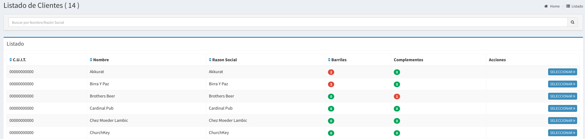

# Ajuste x Cliente

## Listado de Clientes para Ajuste

Esta pantalla muestra todos los clientes y cuantos barriles y complementos posee. La funcionalidad de la misma es realizar ajustes manuales, sería entregas sin ventas asociadas.


Es útil al inicializar el sistema para decir quien tiene tus barriles


Lo primero que hay que realizar es selección el cliente al que se le desea entregar un barril y/o complemento con el botón **Seleccionar**.


Recordar  esto no es el proceso usual, las entregas deberían ser utilizando las ventas. Solo se utiliza en situaciones especiales.


## Selección de Cliente

Usted ahora verá una pantalla como la siguiente

En esta pantalla usted podrá:

* Ver los barriles que posee el Cliente
* Ver los complementos que posee el Cliente
* Entregar Barriles manualmente
* Entregar Complementos manualmente.

## Entrega de Barriles

Basta hacer `click` en la pestaña '**Entrega Manual**'

Utilizando la barra de búsqueda, usted podrá ir poniendo códigos de barriles y una vez finalizado deberá poner **Guardar** para confirmar la entrega.


Una vez entregados usted ya no podrá utilizar los barriles hasta su devolución.



El sistema validará que los barriles se encuentren en fabrica antes de entregarlos.


 

## Entrega de Complementos

Basta hacer `click` en la pestaña '**Entrega Complementos**'

Utilizando la barra de búsqueda, usted podrá ir poniendo códigos de complementos y una vez finalizado deberá poner **Guardar** para confirmar la entrega.


Una vez entregados usted ya no podrá utilizar los complementos hasta su devolución.


