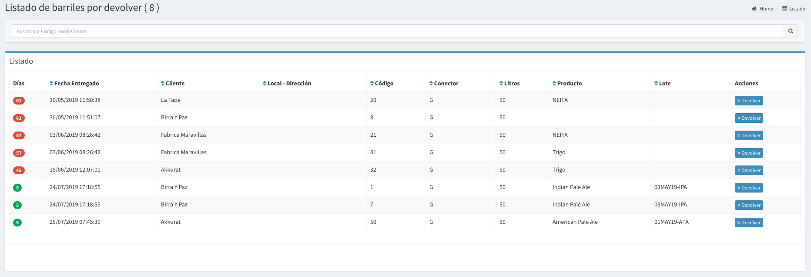

# Barril x Devolver

## Listado de Barriles por Devolver

En esta pantalla se podrá observar todos los barriles Entregados a los clientes y hace cuantos días fueron entregados.  Las columnas darán un detalle de los datos relevantes del barril desde el punto de vista de la devolución.

* **Días**: es la cantidad de días que esta en el Cliente
* **Fecha Entregado:** Es fecha en que se entregó el barril
* **Cliente:** Es el cliente que tiene el barril.
* **Local:** Es el local \(del Cliente\) en el que se entregó el barril
* **Código:** es el código del barril
* **Conector:** es el conector del barril
* **Producto:** es la cerveza que tenía el barril
* **Lote:** es el lote en el que se produjo la cerveza.

Para devoluciones de varios barriles es más útil la pantalla :



Más allá de eso, en esta pantalla apretando devolver también se puede devolver el barril.


La idea es que siempre puedas saber quien te debe barriles y desde hace cuanto.


