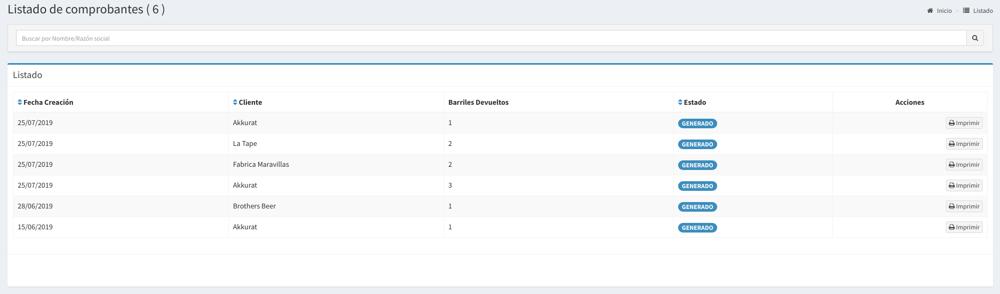

# Comprobantes

## Listado de Comprobantes

En esta pantalla se podrá observar todos los comprobantes de devolución generados por el sistema.  Las columnas darán un detalle de los datos relevantes de una de las devoluciones:

* **Fecha Devolución:** Es la fecha en la que se registró la devolución.
* **Cliente:** Es el Cliente en que estaban los barriles
* **Barriles Devueltos:** es la cantidad de barriles devueltos


Recordar que cuando se devuelven muchos barriles se agrupan por clientes en un único comprobante por cliente.


Haciendo `click` en el botón **imprimir** podrás ver el comprobante para darselo al Cliente.

