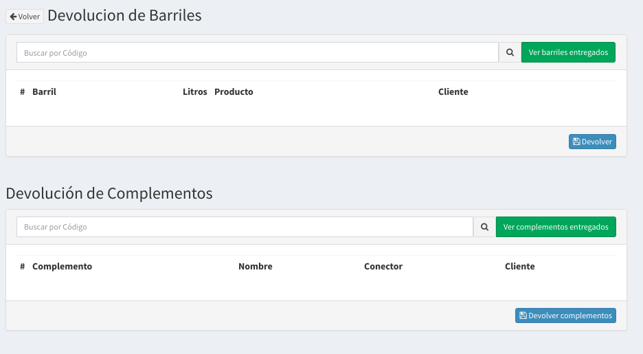
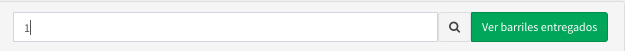
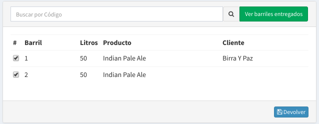

# Devolución

## Pantalla de Devolución

## Devolución de Barriles

En esta pantalla se podrá realizar la devolución tanto de Barriles como de Complementos.

El procedimiento es sencillo, se comienza escribiendo en la barra de búsqueda un código, por ejemplo, '1':

 

Luego se presiona `Enter`, de esta manera el sistema buscará si el barril se encuentra en **Entregado** o **Lleno** si se da esta situación usted podrá ir viendo los barriles que vaya seleccionando.


Si el barril no se encontrará **Entregado** o **Lleno** el sistema dará un error.


Una vez que haya terminado de cargar los barriles no sé olvide de hacer `click` en el botón **Devolver**.

El procedimiento de Devolver Barriles realiza las siguientes funciones:

* Marca el Barril como **Vacío**
* Saca el Barril como pendiente de devolución en el Cliente
* Genera un Comprobante de las devoluciones \(1 por Cliente\)
* Guarda para fines estadísticos la cantidad de tiempo que el barril estuvo en el cliente.

Para ver más acerca del comprobante de devolución:



## Devolución de Complementos

Para la devolución de Complementos se procede exactamente igual que para la devolución pero no sé generan comprobantes de los mismos.

