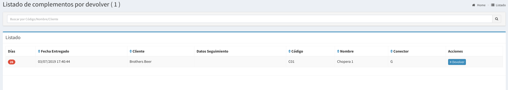

# Otros x Devolver

## Listado de Complementos por Devolver

En esta pantalla se podrá observar todos los complementos Entregados a los clientes y hace cuantos días fueron entregados.  Las columnas darán un detalle de los datos relevantes del complemento desde el punto de vista de la devolución.

* **Días**: es la cantidad de días que esta en el Cliente
* **Fecha Entregado:** Es fecha en que se entregó el complemento
* **Cliente:** Es el cliente que tiene el complemento.
* **Datos Seguimiento:** Es el local \(del Cliente\) en el que se entregó el barril
* **Código:** es el código del complemento
* **Conector:** es el conector del complemento \(si es chopera\)
* **Nombre:** es el nombre del complemento.

\*\*\*\*

Para devoluciones de varios complementos es más útil la pantalla :



Más allá de eso, en esta pantalla apretando devolver también se puede devolver el complemento.


La idea es que siempre puedas saber quien te debe un complemento y desde hace cuanto.


