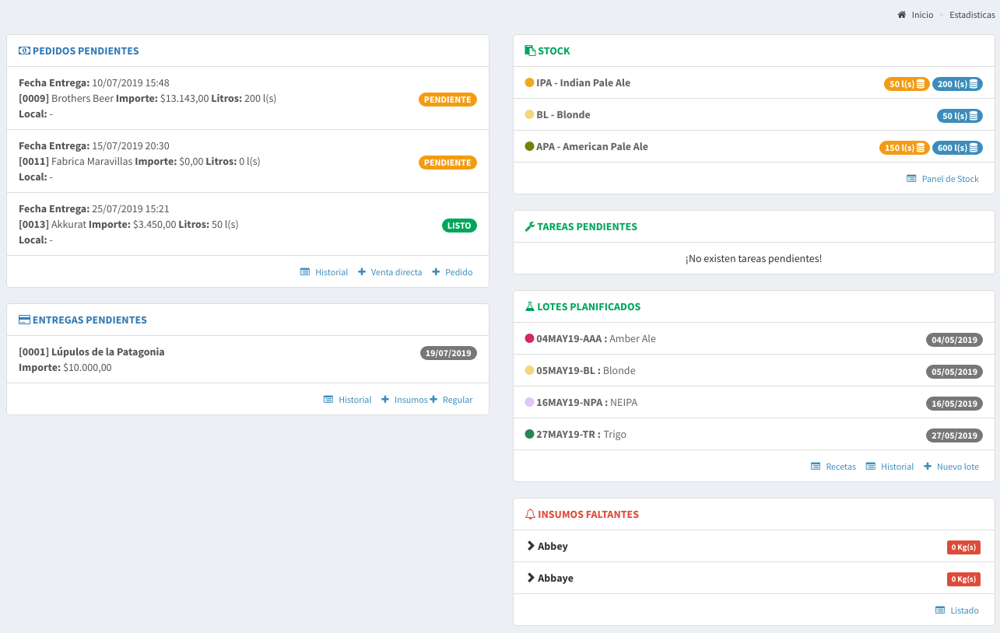
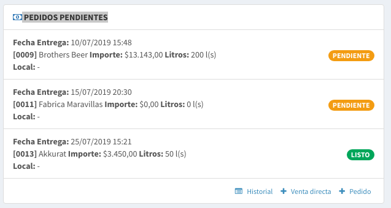
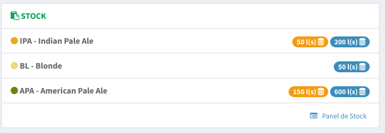
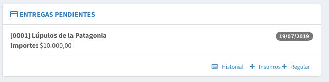
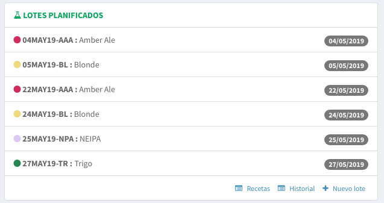
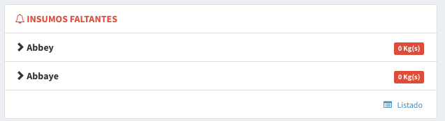

# Pantalla de Inicio

## Pedidos Pendientes \(Ventas\)

En este recuadro podremos ver las ventas que tenemos pendientes, es decir, las que no fueron entregadas. La idea es que siempre estén visibles para que no se pierdan en el olvido.

Haciendo `click` en cualquiera de ellas se accede al detalle de la venta.

También en la parte inferior hay accesos rápidos al **listado de ventas**, a **alta de una venta directa** y al **alta de una pedido.**

## Stock

En este recuadro se puede ver los distintos productos que se posee stock.


Este stock considera solo los productos embarrilados


Los indicadores amarillos como el siguiente indican que hay 50 litros en barriles asignados a una o más ventas.

Los indicadores azules como el siguiente indican que hay 200 litros en barriles disponibles para vender. Este número **no tiene** en cuenta los litros asignados \(estos **no se consideran disponibles** dado que esta **reservados**\).

## Compras Pendientes de Entrega

En este recuadro podremos ver las compras que tenemos pendientes, es decir, las que no fueron entregadas. La idea es que siempre estén visibles para que no se pierdan en el olvido.

Haciendo `click` en cualquiera de ellas se accede al detalle de la compra.

También en la parte inferior hay accesos rápidos al **listado de compras**, a **alta de una compra de insumos/artículos** y al **alta de una compra regular**

## **Lotes Planificados**

Esta pantalla muestra todos los lotes planificados, con su fecha de inicio de cocción.

También en la parte inferior hay accesos rápidos a las **recetas**, al **listado de lotes** y para crear un **nuevo lote.**

## **Insumos Faltantes**

Acá podremos ver todos los insumos que están por debajo del stock mínimo.

