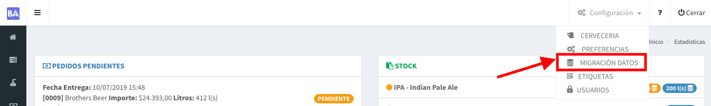
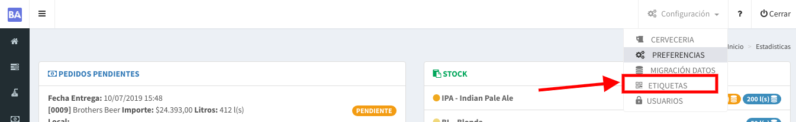
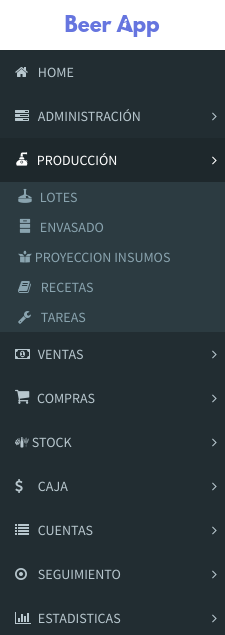

# Configuración Inicial

## 1. Carga de datos inicial

Siguiendo el `link` a continuación te mostrará como cargar tus datos iniciales con nuestro asistente.

Para acceder al mismo desde la web tendrás que ir a :



## 2. Impresión de Etiquetas QR

Siguiendo el `link` a continuación te mostrará como cargar generar tus etiquetas a partir de tus barriles


Recordá cargar tus barriles primero


Para acceder al mismo desde la web tendrás que ir a :



## 3. Registrar los Tanques

Luego de la migración es necesario cargar los tanques que hay en tu fábrica.



## 4. Organización del Manual de Usuario

Para facilidad del usuario las pantallas de manual están relacionadas con el menú del sistema desde la web. Cada acceso del menú  posee una página en la documentación que explica ese menú.

Por ejemplo si queremos saber más sobre la _**pantalla Lotes en el módulo de Producción**_. Basta acceder en la sección **Producción** del manual al `link` **Lotes**.



