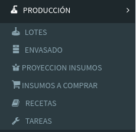

# Menú Web

## 01\) Lotes

Por esta pantalla se podrán crear, visualizar y modificar los Lotes de los distintas cervezas



## 02\) Envasado

Por esta pantalla se podrá realizar los envasados de los lotes activos o por medio de barriles.



## 03\) Proyección Insumos

Esta sección tiene como idea de saber los insumos necesarios para planear las Lotes que se encuentran en estado PLANIFICADO



## 04\) Insumos a Comprar

Tomando en cuenta la proyección de insumos, se generar el listado de insumos faltante.



## 05\) Recetas

En esta sección usted podrá definir los insumos que se utilizan para hacer los distintos estilos de cervezas.



## 06\) Tareas

En esta sección usted podrá planificar tareas asociadas al proceso de control de un Lote.



