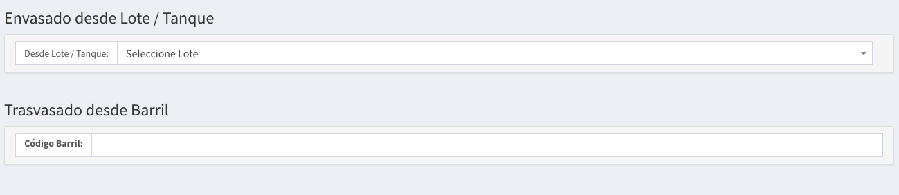
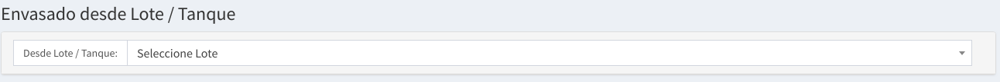
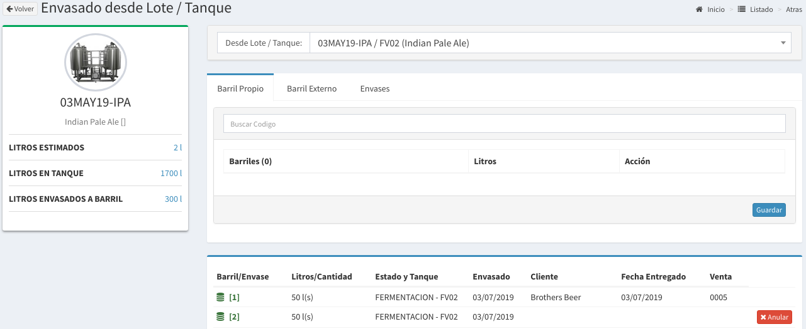
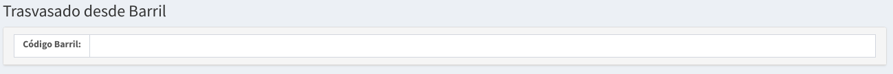
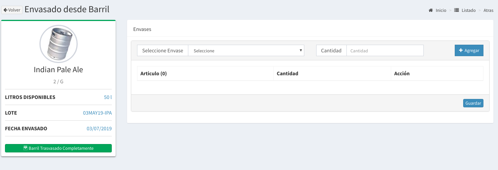

# Envasado

## Tipos de Envasados

Existen dos formas de envasados:

* Desde un Lote:  Se llenan los barriles u envases desde los Tanques
* Desde un Barril: Se llenan los envases utilizando un Barril ya envasado.

## Envasado desde Lote / Tanque

Es la forma principal de Envasado, cada Lote es envasado a Barriles utilizando este método. Se procede seleccionando el Tanque \(Fermentado/Madurador\) desde donde se va a realizar el envasado.

Una vez seleccionado usted verá una pantalla como la que sigue:

En la misma usted podrá realizar las siguientes cosas:

* Puede ver el listado de los envasados asociados al mismo lote.
* Puede envasar barriles
* Puede envasar envases \(botella, latas, pets\)
* Puede llenar barriles externos.

El procedimiento para envasar barriles, envases o barriles externos es similar.

Se empieza completando la información necesaria para cada situación y agregándolo una vez finalizada la carga presiona el botón **Guardar** debajo del listado correspondiente barril/envase/externo y listo.

## Trasvasado desde Barril

Es la forma más normal de envasado a botella / lata. Se procede seleccionando el Barril desde donde se va a realizar el envasado.

Una vez seleccionado usted verá una pantalla similar a la de envasado desde Lote/Tanque:

En este caso tiene que elegir el tipo de envase y la cantidad, y luego hacer `click` en **Agregar**. Cuando ya no haya envases que agregar presiona **Guardar** y se marcarán los envases como llenos.


Cuando finalice el envasado recuerde poner el botón **Barril Trasvasado Completamente.** Este botón marcará como **vacío** al **Barril**


