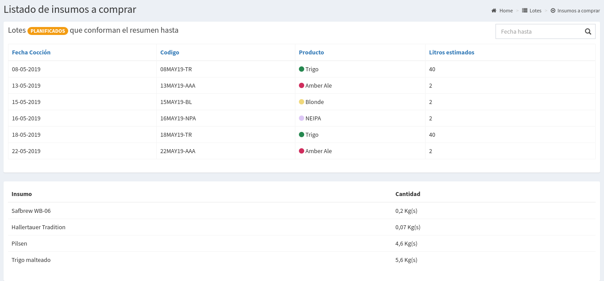
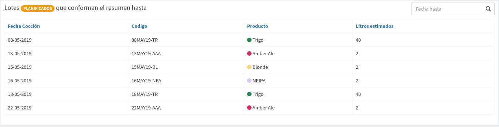
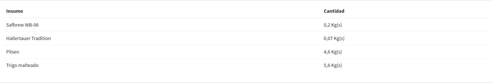

# Insumos a Comprar

## Detalle de Insumos

El objetivo de la pantalla es poder saber los insumos que son necesarios para realizar los lotes que tenemos planificados.

La primer parte costa de un resumen de los lotes que se están teniendo en cuenta para realizar el calculo:

Utilizando las recetas asociada a estos lotes y si los mismos descuentan o no stock se calcula un listado de insumos que son necesarios comprar para realizar las cocciones.

