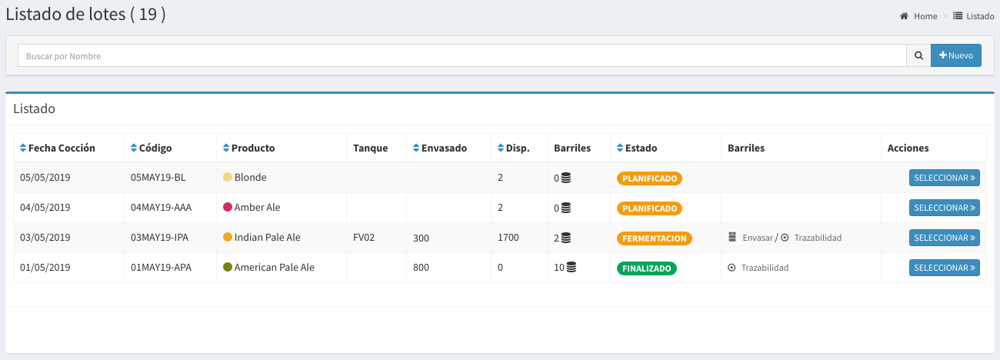
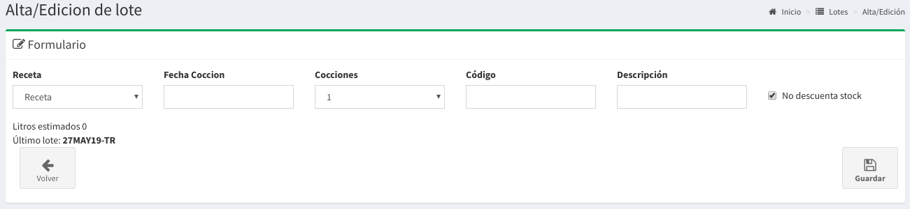
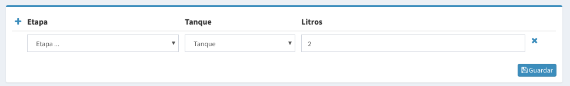

# Lotes

## Listado de Lotes

En esta pantalla se podrá observar todas los lotes. Las columnas darán un detalle de los datos relevantes de cada lote.

* **Fecha Cocción**: es fecha estimada de inicio de cocción.
* **Código**: es el código del lote, nos sirve para identificar un lote en el futuro.
* **Producto**: es el producto que se produce con la receta
* **Tanque:** es el tanque que contiene la cerveza.
* **Envasado:** es la cantidad de litros envasados hasta el momento
* **Disp:**  es la cantidad aproximada de litros por envasar
* **Barriles:**  Son los barriles ya envasados que todavía no vendiste este lote.
* **Estado:**  Lo explicaremos más adelante.


Los **litros** de tu receta se utilizan para estima cuantos litros vas a producir en cada lote. \(Teniendo en cuenta el número de cocciones\)


## Búsqueda de Lote

Por medio de la barra de búsqueda se podrá filtrar los **lotes**  por su **nombre**. Basta escribir un texto y apretar `Enter`

## Nuevo Lote

Para crear un nueva **Lote** basta hacer `click` a la derecha de la barra de búsqueda en el botón **'Nuevo'** .

Luego de esto aparecerá un formulario como el que sigue:

Los campos a completar son los siguientes:

* **Receta**: es el nombre de la receta que vas a seguir.
* **Fecha Cocción**: es la fecha de inicio de cocción.
* **Cocciones**: es la cantidad de cocciones que vas a realizar
* **Código**: es el código de lote
* **Descripción**: descripción si es necesario.
* **No descuenta stock?**: Si se activa, no sé descontará los insumos de tu stock.


Si no manejas el stock por sistema aún o es una cocción con insumos que no estan en el stock. Podes tildar la opción de **no descuenta stock**



Teniendo en cuenta los **litros** estimados de la receta y la cantidad de **cocciones** podemos estimar lo siguiente

**`litros_estimados = cocciones * litros_receta`**



Lo mismo pasa con los **insumos**, se multiplicará los insumos por la cantidad de **cocciones**.


Luego podes poner `click` en **Guardar** y se guardará tu **lote** el mismo quedará como `PLANIFICADO`.

## Detalle de la Receta

En el **listado de recetas** basta hacer `click` en el botón seleccionar de la receta que queremos saber más información para que nos llevé a la pantalla de detalle.

A continuación se mostrará una pantalla como la siguiente:


Acá podrás ver que se **copiaron** todos los **insumos** de la receta base.



Cualquier modificación de los insumos **no se verá reflejada en la Receta.** Si algún insumo no tenes stock podes cambiarlo por otro si tocar la receta base


Podrás realizar todas las modificación que gustes y cuando sea el día de la cocción deberás hacer `click` en el botón **Comenzar**


Una vez comenzado la cocción ya no podrás modificar ningún insumo.



En este momento si tenias habilitado la opción se descontarán todos los insumos utilizados


## Registrar en qué Tanque se guarda un Lote

Una vez terminada la **cocción** o la primera cocción tendrás la posibilidad de camiar el estado al lote que actualmente esta `EN COCCIÓN.`

Esto lo podes realizar ingresando al **Detalle de Lote**, ahí podrás ver este formulario:

Los campos necesarios son los siguientes

* **Etapa:** podrás elegir una etapa descriptiva de en que proceso se encuentra el lote.
* **Tanque:** tenes que elegir a que tanque vas a mandar tu cerveza
* **Litros:** acá podes ir puliendo los litros estimados que hay en el tanque.


El sistema validará que el Tanque este **VACIO** antes de asignarlo.



Si divides un lote en varios tanques podes hacer `click` en el **+** en la esquina superior izquierda para agregar otro tanque.



Recuerda que cuando sale de cocción siempre tendrá que estar en, al menos, 1 tanque hasta su finalización.


Desde ahora hasta que finalices el lote tendrás disponibles las opciones de envasar o embarrilar.

## Finalizar un Lote

Cuando **no haya más que envasar** y los tanques estén vacíos de este Lote lo que tienes que hacer es finalizarlo.


Atención luego de finalizar ya no se podrá seguir envasando.



Todo lo que ya envaso seguirá igual, solo no se podrá envasar más


Al finalizar se recolectan estadísticas como cuantos litros reales se envasaron para su posterior uso.

