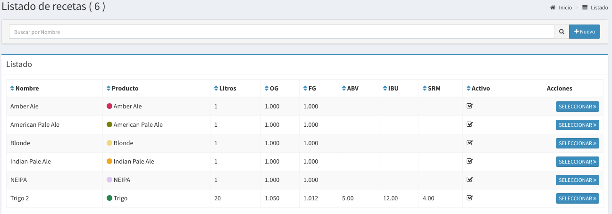
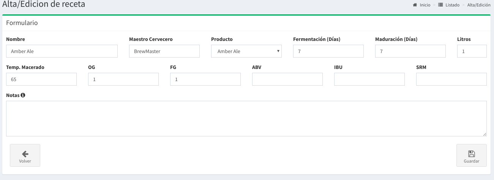
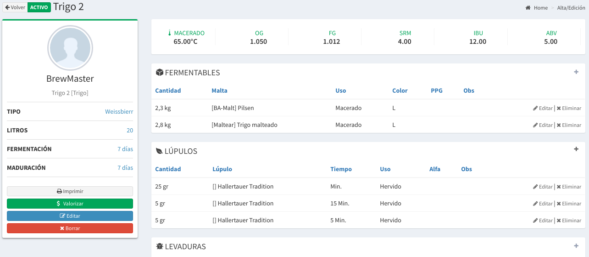

# Recetas

## Listado de Recetas

En esta pantalla se podrá observar todas las recetas activas. Las columnas darán un detalle de los datos relevantes de cada receta.

* **Nombre**: es le nombre de la receta
* **Producto**: es el producto que se produce con la receta
* **Litros:**  es la cantidad de litros estimada por cocción
* **OG:**  Densidad inicial
* **FG:**  Densidad final
* **ABV:** alcohol estimado de tu cerveza
* **IBU:** amargor estimado de tu cerveza.
* **SRM:** Color aproximado de tu cerveza


Los **litros** de tu receta suelen estar relacionados con tu bloque de cocción.


## Búsqueda de Recetas

Por medio de la barra de búsqueda se podrá filtrar las **recetas**  por su **nombre**. Basta escribir un texto y apretar `Enter`

## Nuevo Receta


En general no es necesario crear recetas excepto que tengas distintos bloques de cocción y necesites dos recetas para un mismo producto debido a los litros.



Cuando se crea un nuevo **Producto** automáticamente se crea una **Receta** nueva. Así que lo normal es modificar esa receta.


Pero si necesitas crear una nueva **Receta** basta hacer `click` a la derecha de la barra de búsqueda en el botón **'Nuevo'** para acceder al formulario para la creación de un nuevo Receta.

Luego de esto aparecerá un formulario como el que sigue:

Los campos a completar son los siguientes:

* **Nombre**: es el nombre de tu receta
* **Maestro Cervecero**: es el creador de la receta
* **Producto**: es la cerveza que vas a producir
* **Fermentación Días**: son los días aproximado de fermentación
* **Maduración Días**: son los días aproximado de maduración.
* **Litros**: Litros estimados de la receta.
* T**emp. Macerado**: temperatura de marcerado.
* **OG**: Densidad Inicial
* **FG**: Densidad Final
* **ABV**: Alcohol de tu cerveza
* **IBU**: Amargor de tu cerveza
* **SRM**: Color de tu cerveza
* **Notas**: Otras notas referidas al proceso de cocción.

Muchos son datos descriptivo que no son obligatorios, lo más importante es los **litros** porque estos se usan para estimar tu stock de cerveza en cocción realizar, luego podes poner `click` en Guardar y se guardará tu receta.

## Detalle de la Receta

En el **listado de recetas** basta hacer `click` en el botón seleccionar de la receta que queremos saber más información para que nos llevé a la pantalla de detalle.

A continuación se mostrará una pantalla como la siguiente:

En esta pantalla usted podrá cargar todos los insumos asociados a cada receta en su sección correspondiente:

* **FERMENTABLES**
* **LÚPULOS**
* **LEVADURA**
* **OTROS**


El sistema ya viene cargado con muchos insumos pero si algún insumo no se encuentra, podrás cargarlo en 

`Administracion -> Insumos`


También podrás **editar** la receta haciendo `click` en **Editar**.

## Precios de los Insumos

Si tenes cargados los precios por Kg/s de cada insumo podrás valorizar tu receta y ver un estimado de cuanto cuesta producir una cocción en términos de materia prima.

