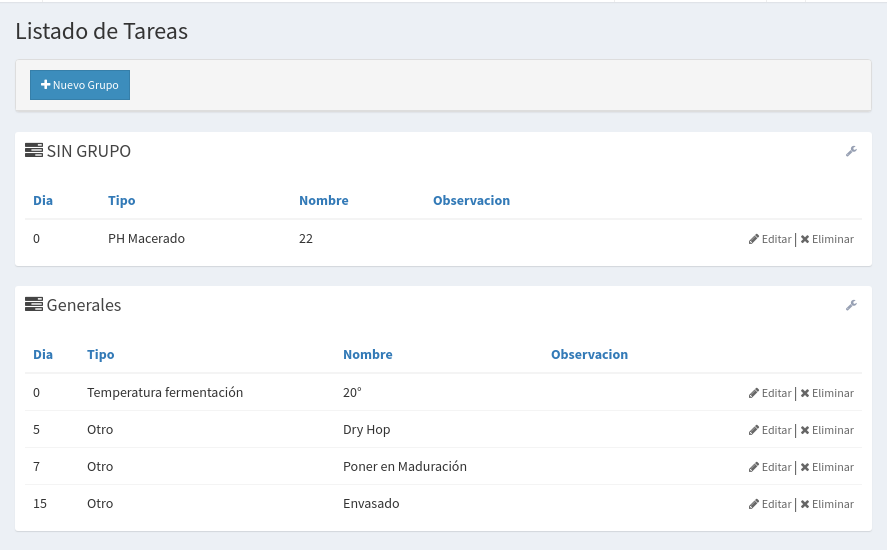
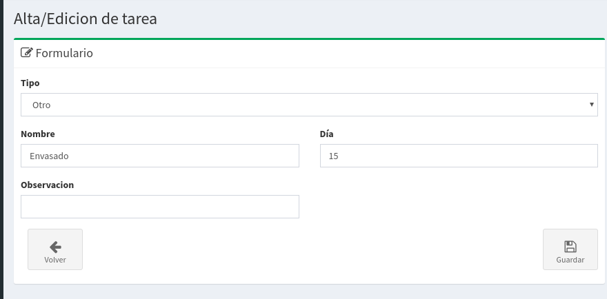

# Tareas

## Creación y Edición de Tareas

Las tareas son una funcionalidad para controlar el proceso de producción, las mismas están creadas para:

* Seguir una listas de pasos para el control de calidad de tu cerveza.
* Realizar una serie de mediciones con el fin de registrar como va evolucionando cada lote
* Recordar en todo momentos las acciones que se tiene que realizar para producción cada receta.

Las mismas tiene una **fecha programada** para realizarlas y el sistema avisará cada día los tareas a realizar.

## Grupos de Tareas

La idea es poder agrupar tareas de forma de poder incluirlas en las receta de manera más simple.

Básicamente un grupo de tareas junta bajo un mismo nombre varias acciones a controlar, el criterio para crear un grupo puede varias, por ejemplo:

* Se puede crear un grupo por cada estilo de cerveza
* Se puede crear un grupo por cada etapa de la producción, ejemplo Cocción, Fermentación, Maduración, etc.
* Se pueden crear grupos para cumplir con procesos de calidad

Una vez creado el grupo se puede asociar el mismo a una Receta.

## Tareas

Son la unidad básica, ya sea que pertenezca a un grupo o no. Son acciones que queremos realizar cada vez que producción una cerveza. Por ejemplo:

* Controlar la densidad
* Realizar un dry hop
* Envasar después de n días
* Llevar la temperatura a X grados
* Tomar una medición de alcohol

Las tareas se componen de:

* **Tipo**: El tipo de Tarea a realizar
* **Nombre**: El nombre de la tarea
* **Día**: El día que se debería realizar esa tarea \(tomando el día 0 como el inicio de la cocción\)
* **Observación**: Otros datos relevantes para la tarea

Para ver como asociar tareas a una **Receta**



