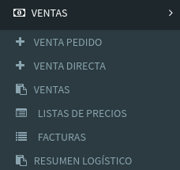

# Menú Web

## 01\) Venta Pedido

Por este formulario se podrán cargar nuevas ventas a partir de un Pedido de un Cliente



## 02\) Venta Directa

Por este formulario se podrán cargar nuevas ventas directas a partir de los barriles que posee en fábrica



## 03\) Ventas

En esta sección se verán el listado de ventas y darle su seguimiento.



## 04\) Listas de Precios

En esta sección se podrá crear múltiples listas de precios y cargar precio de Productos y Artículos



## 05\) Facturas

En esta sección se verán el listado de facturas registradas en el sistema.



## 06\) Resumen Logístico

Este informe es útil para saber las necesidades de stock para satisfacer la demanda que hay en los pedidos. 



