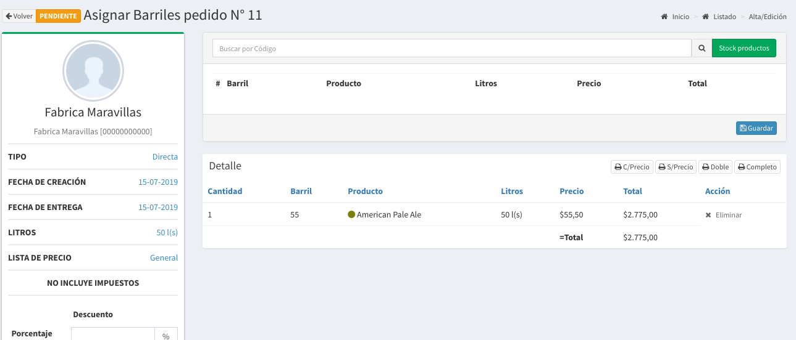
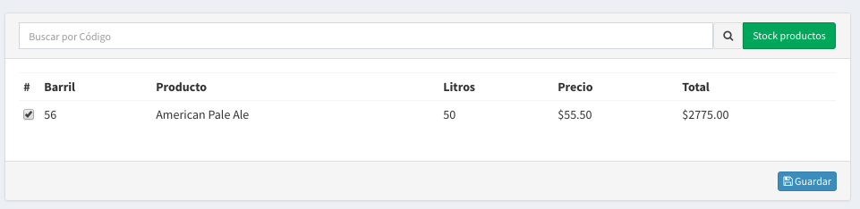
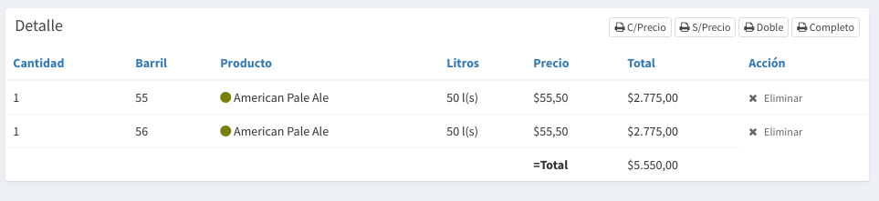
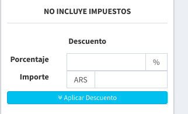

# Nueva Venta Directa

## Formulario de Venta Directa

Los datos solicitados para crear un Pedido son

* **Cliente:**  se selecciona el cliente
* **Local:**  se selecciona Local del cliente a donde se entregará
* **Lista de Precios:** seleccionar la lista de precio a utilizar.
* **Fecha Entrega:** Es fecha de entrega estimada
* **Hora Entrega:** Es la hora de entrega estimada
* **Datos extras de seguimiento:** Si utilizas un cliente genérico como 'Consumidor Final' en este campo podrás anotar datos extras como nombre, apellido, telefono de la persona para poder saber a quien entregaste tus barriles.
* **Observaciones:** Son observaciones relativas a la entrega
* **Incluir Impuestos:** Si desea que el sistema calcule los impuestos.

Luego de completar estos campos podrá realizar `click` en Guardar.

De esta forma se creará una venta sin barriles y podrás pasar a la siguiente pantalla para cargar los mismos.

## Carga de Barriles

Utilizando el siguiente formulario podrá ir eligiendo los barriles de el stock disponible.

Basta escribir el **código** del barril y poner `Enter` para que se cargué en el listado. Una vez seleccionado los barriles hay que poner **Guardar** para que se los cargué en la venta. Luego de eso usted verá que aparecen en el listado a continuación.

## Descuentos

En la parte lateral se tiene la posibilidad de aplicar un descuento tanto en términos de porcentaje como en términos de importe. 


En un venta solo se puede aplicar un único descuento ya sea importe o porcentaje


Después de completar el importe o el porcentaje se tiene que hacer `click` a **Aplicar  Descuento** para que el mismo se guarde.

## Marcar pedido como Listo

Cuando ya no tengamos que agregar ningún barril, ni aplicar ningún descuento podemos poner la venta como 'Lista' simplemente haciendo `click` en el botón **Listo**.

## Marcar como Entregado

Una vez que hayamos realizado la Entrega del pedido al cliente debemos poner.


En el momento que se haya puesto entregar el pedido no podrá ser modificado de ninguna forma. 


Al entregar un venta se realizan una serie de tareas:

* Se marca la venta como **Entregada** y se evita que se modifique
* Se carga el total a la **cuenta corriente del Cliente**
* Se marcan todos los **barriles como entregados** a el Cliente.
* Se registra la **fecha de entregado** como la fecha de **hoy**.
* **Tomando esa fecha** se empieza a contar los días de los barriles fuera de la fabrica.
* Si el cliente tiene activada la opción de notificaciones, **se envía un e-mail** con el remito de la venta.

