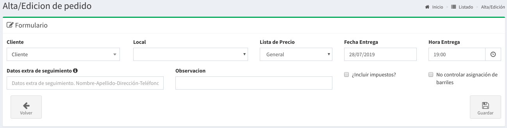
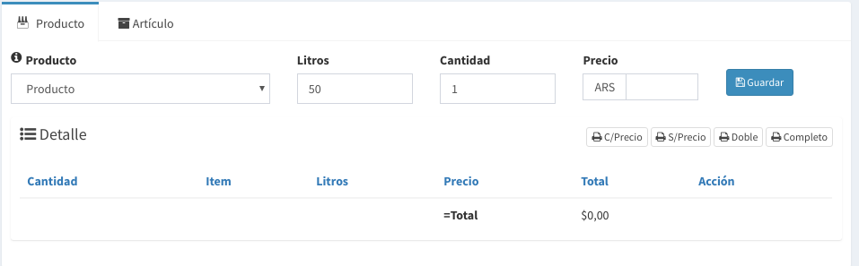
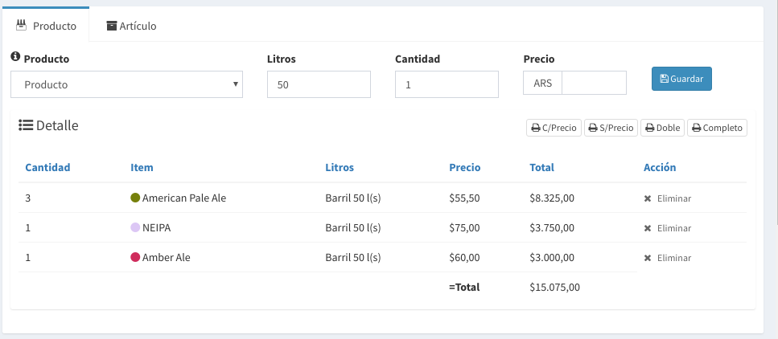
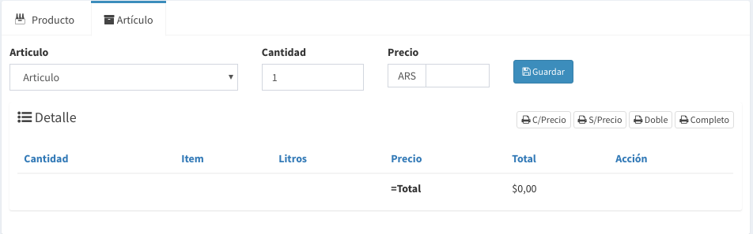
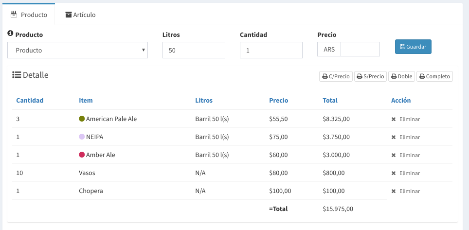
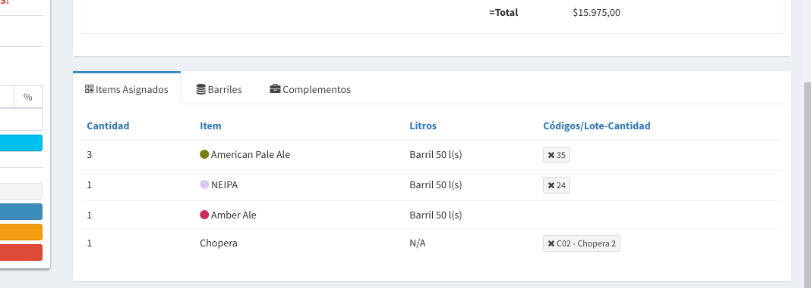
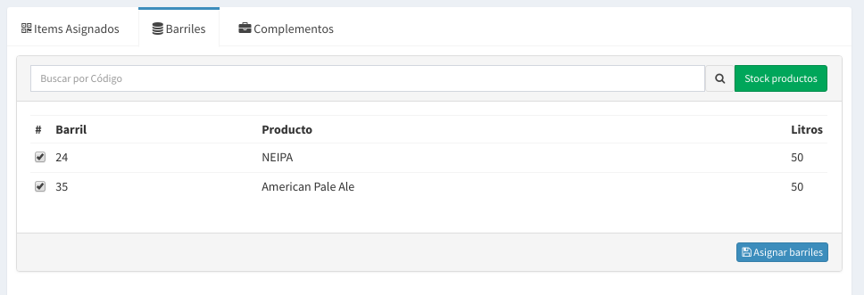
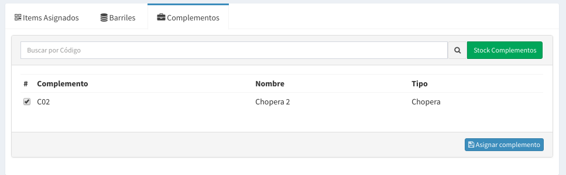
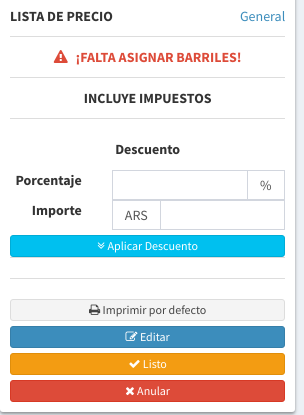
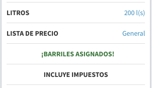

# Nueva Venta Pedido

## Formulario de Pedido

Los datos solicitados para crear un Pedido son

* **Cliente:**  se selecciona el cliente
* **Local:**  se selecciona Local del cliente a donde se entregará
* **Lista de Precios:** seleccionar la lista de precio a utilizar.
* **Fecha Entrega:** Es fecha de entrega estimada
* **Hora Entrega:** Es la hora de entrega estimada
* **Datos extras de seguimiento:** Si utilizas un cliente genérico como 'Consumidor Final' en este campo podrás anotar datos extras como nombre, apellido, telefono de la persona para poder saber a quien entregaste tus barriles.
* **Observaciones:** Son observaciones relativas a la entrega
* **Incluir Impuestos:** Si desea que el sistema calcule los impuestos.
* **No controlar asignación de barriles:** Esto permite que el sistema **no** verifique que todos los barriles que solicito el cliente este asignados para pasar un pedido como **Listo**. Es útil cuando se utilizan barriles ajenos a la cervecería.

Luego de completar estos campos podrá realizar `click` en Guardar.

De esta forma se creará una venta sin productos y podrás pasar a la siguiente pantalla para cargar los mismos.

## Carga de Productos

En este formulario podrás cargar tus productos, el mismos solicita los siguientes datos:

* **Producto**: acá podes seleccionar tu cerveza con los distintos envases que tengas cargado \(solo veras los productos que tengan precios\)
* **Litros**: si es un barril podrás elegir los litros de barril solicitado
* **Cantidad**: la cantidad de barriles o envases pedidos
* **Precio**: acá podrás modificar el precio que se carga de la lista de precio.

Luego de seleccionar los datos y hacer `click` en **Guardar** para elegir todos los productos que necesites podras ir viendo la lista de tus productos seleccionados.

## Carga de Artículos

En este formulario podrás cargar tus productos, el mismos solicita los siguientes datos:

* **Artículo**: acá podes seleccionar los artículo que tengas cargado \(solo veras los artículos que tengan precios\)
* **Cantidad**: la cantidad de artículos pedido
* **Precio**: acá podrás modificar el precio que se carga de la lista de precio.

Luego de seleccionar los datos y hacer `click` en **Guardar** para elegir todos los artículos que necesites podrás ir viendo la lista de tus productos y artículos seleccionados.

## Asignación de Barriles y Complementos

Esta parte de la pantalla sirve para seleccionar los barriles que se le van a entregar al cliente.

Existen 3 pestañas:

* **Items Asignados:** Acá veras un resumen de lo que fue asignado
* **Barriles:** Acá podrás asociar barriles a lo que pidió el cliente
* **Complementos:** Acá podrás asociar complementos a lo que pidió el cliente.

### Barriles

En esta parte podremos escribir el **código** de barril, poner `Enter` y el sistema buscará el barril y traerá los datos necesarios.


El sistema comprobará que el barril se encuentre lleno y que tenga algún producto que usted haya solicitado, sino mostrará un error.


Una vez seleccionados los barriles hay que hacer `click` en el botón **Asignar Barriles** y el sistema los guardará.


Puede utilizar el botón verde de **Stock de productos** para ver los los barriles disponibles.


### Complementos

En esta parte podremos escribir el **código** del complemento, poner `Enter` y el sistema buscará el complemento y traerá los datos necesarios.


El sistema comprobará que el complemento se encuentre disponible y que haya un artículo de este tipo solicitado, sino mostrará un error.


Una vez seleccionados los complementos hay que hacer `click` en el botón **Asignar Complementos** y el sistema los guardará.


Puede utilizar el botón verde de **Stock de Complementos** para ver los complementos disponibles.


## Descuentos

En la parte lateral se tiene la posibilidad de aplicar un descuento tanto en términos de porcentaje como en términos de importe. 


En un Pedido solo se puede aplicar un único descuento ya sea importe o porcentaje


Después de completar el importe o el porcentaje se tiene que hacer `click` a **Aplicar  Descuento** para que el mismo se guarde.

## Marcar pedido como Listo

Unas vez que hayamos asignados todos los barriles solicitados el sistema mostrará en el costado el siguiente cartel de 'Barriles asignados'

Cuando ya no tengamos que agregar ningún producto/artículo, aplicar ningún descuento, ni asignar ningún barriles podemos poner la venta como 'Lista' simplemente haciendo `click` en el botón **Listo**.


El sistema validará que estén todos los barriles asignados, en caso contrario dará un error.



Esta validación de barriles asignados no se realizará si en el formulario se tildo la opción de **`No controlar asignación de barriles`**


La venta ahora no podrá alterarse excepto que revierta el listo.

## Marcar como Entregado

Una vez que hayamos realizado la Entrega del pedido al cliente debemos poner.


En el momento que se haya puesto entregar el pedido no podrá ser modificado de ninguna forma. 


Al entregar un pedido se realizan una serie de tareas:

* Se marca la venta como **Entregada** y se evita que se modifique
* Se carga el total a la **cuenta corriente del Cliente**
* Se marcan todos los **barriles como entregados** a el Cliente.
* Se registra la **fecha de entregado** como la fecha de **hoy**.
* **Tomando esa fecha** se empieza a contar los días de los barriles fuera de la fabrica.
* Si el cliente tiene activada la opción de notificaciones, **se envía un e-mail** con el remito de la venta.

