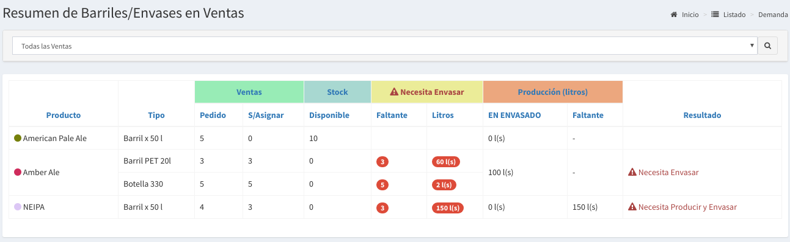
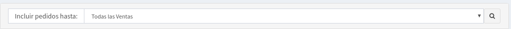
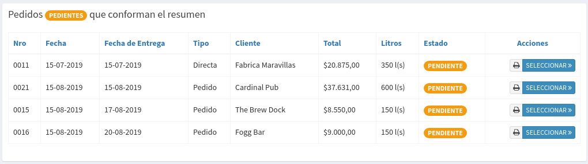

# Resumen Logístico

## Listado por Producto pedido

En esta tabla se podrá observar los productos solicitados en una o más ventas. Las columnas se detallan a continuación:

* **Producto**: es la cerveza solicitada
* **Tipo**: es el tipo de envase o barril solicitado
* **Pedido**: es la cantidad de envases o barriles pedidos
* **S/Asignar**: es la cantidad de esos envases o barriles que todavía no fue asignado
* **Disponible:** es la cantidad que poseo disponible en fabrica
* **Faltante:** es la cantidad de barriles o envases que me faltan
* **Litros**: es la cantidad en litros que falta envasar o embarrilar.
* **EN ENVASADO**: es la cantidad de litros para envasar que poseo en los tanques.
* **Faltante**: son los litros que necesito producir para poder envasar lo faltante.
* **Resultado**: es la acción a realizar.

## Filtro de Ventas

Muchas veces uno solo quiere preparar los próximos pedidos para esto se ofrece la funcionalidad de filtrar las ventas de acuerdo al siguiente criterio:

* Todas las Ventas Pendientes
* Hoy: Todas las Ventas que se deberían entregar hasta el día de la fecha
* Mañana: Todas las Ventas que se deberían entregar hasta el día de mañana
* Lo mismos pero contando los próximos 2,3,4,5,6,7 días.

## Listado de Ventas

También se muestra el listado de Ventas que se utilizan para calcular el resumen, de esta manera estará visible los pedidos que se están preparando.

