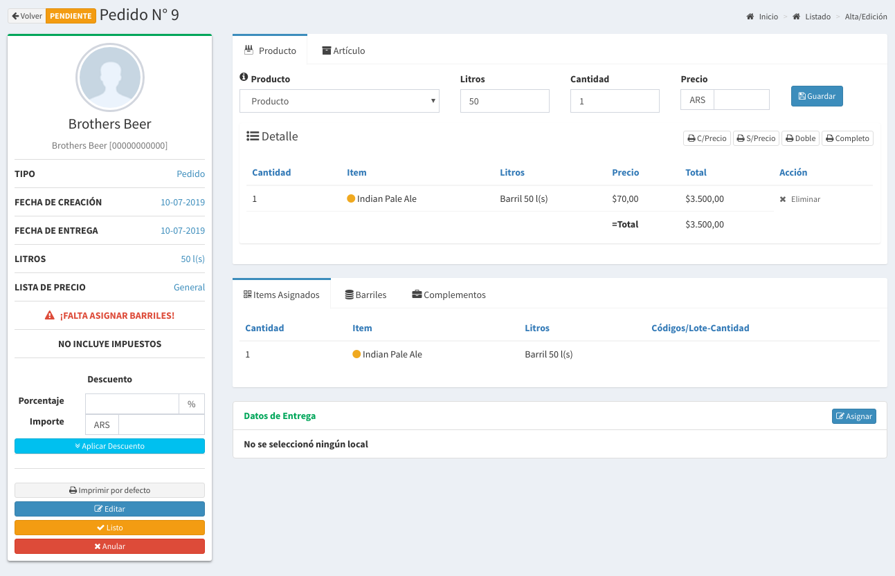

# Ventas

## Tipos de Ventas

Existen dos formas de realizar ventas

* Pedidos:
  * Son creados a partir de los productos que necesita el cliente
  * Luego se le asignan los barriles del stock disponible
  * Posteriormente se los ponen como Listo y luego se Entregan



* Ventas Directas:
  * Solo se pueden hacer utilizando los barriles disponibles.
  * No sé puede cargar ningún otro artículo que no sean barriles



## Listado de Ventas

En esta pantalla se podrá observar todas ventas realizadas. Las columnas darán un detalle de los datos relevantes de las ventas.

* **Nro**: es el número interno asociado a una venta
* **Fecha:**  Es fecha de creación de la venta
* **Fecha entregada:**  Es fecha de entrega o estimada de entrega
* **Tipo:** Es el tipo de venta Directa o Pedido
* **Cliente:** Es el cliente asociado a la venta
* **Total:** Es el importe total de la venta
* **Litros:** Es el total de litros solicitados
* **Estado:** Es el estado de la venta \(se explicará luego\)
* **Lista:** Es la lista de Precio con la que se efectúa la venta
* **Impuesto:** Dice si la venta incluye impuestos por el sistema \(podría ser llevados fuera del sistema\)
* **Factura:** Es el número de factura que esta asociado a la venta

## Estados

Las ventas pueden estar en diferentes estados, los mismos pueden ser:

* **PENDIENTE:** 
  * La venta esta carga en el sistema pero puede que todavía no se le hayan asignados barriles
* **LISTO:** 
  * La venta esta lista para ser despachada.
* **ENTREGADO:** 
  * La venta fue entregada
  * Se le cargo en la cuenta corriente del cliente el saldo
  * Los barriles figuran en posesión del cliente.

## Búsqueda de Ventas

Por medio de la barra de búsqueda se podrá filtrar las ventas tanto por **nombre** como por el **razón social** del cliente. Basta escribir un texto y apretar `Enter`

## Detalle de la Venta

En el **listado de ventas** basta hacer `click` en el botón seleccionar de la venta que queremos saber más información para que nos llevé a la pantalla de detalle.

A continuación se mostrará una pantalla como la siguiente:

